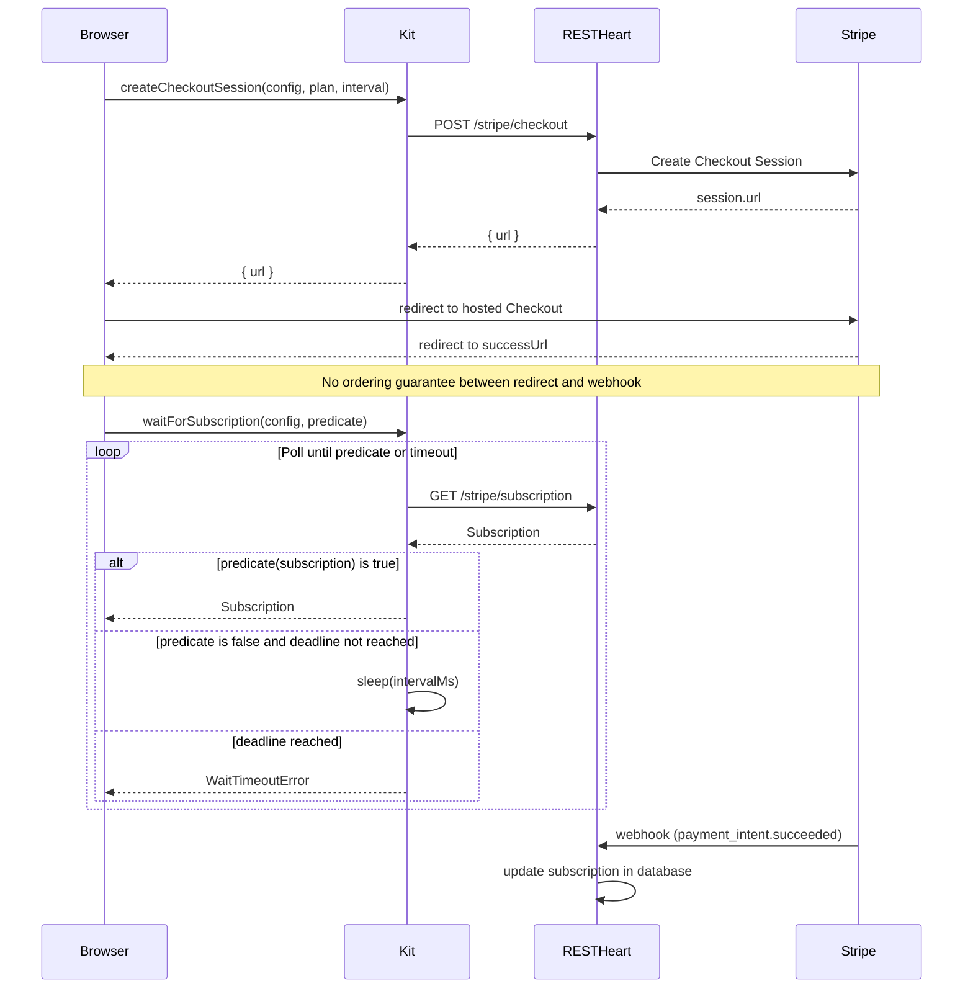

# Architecture Overview

This document explains the technical architecture of the RESTHeart Cloud Kit monorepo, its package structure, and the design principles that guide development.

## Repository Structure

```
restheart-cloud-kit/
├── packages/
│   ├── kit/                    # @restheart-cloud/kit (core)
│   │   ├── src/
│   │   │   ├── auth.ts         # Authentication flows
│   │   │   ├── client.ts       # Token management, API fetch
│   │   │   ├── invite.ts       # Invitation operations
│   │   │   ├── password.ts     # Password reset flows
│   │   │   ├── consents.ts     # Consents gating (acceptConsents)
│   │   │   ├── profile.ts      # User profile and document updates
│   │   │   ├── team.ts         # Team management
│   │   │   ├── payments.ts     # Subscriptions, checkout, billing portal, licences
│   │   │   ├── orders.ts       # Catalog, orders, waitForOrder
│   │   │   ├── cart.ts         # Client-side cart (pure functions, no network)
│   │   │   ├── money.ts        # formatPrice utility
│   │   │   ├── types.ts        # TypeScript interfaces (generic UserInfo<E>)
│   │   │   └── index.ts        # Public API exports
│   │   └── __tests__/
│   │       └── integration/    # Integration tests (live RESTHeart Cloud)
│   │
│   ├── kit-ng/                 # @restheart-cloud/kit-ng (Angular)
│   │   ├── src/
│   │   │   ├── auth.service.ts     # Angular service (signals, Observable methods)
│   │   │   ├── auth.guard.ts       # Route guards (authGuard, publicGuard)
│   │   │   ├── auth.interceptor.ts # HTTP interceptor (bearer token, 401 handling)
│   │   │   ├── http-transport.ts   # HttpClient transport (routes kit calls through interceptor)
│   │   │   ├── provide-rh-auth.ts  # DI setup (provideRhAuth)
│   │   │   ├── tokens.ts           # Injection tokens (RH_AUTH_CONFIG, RH_KIT_REQUEST)
│   │   │   ├── test-providers.ts   # Zoneless test environment providers
│   │   │   ├── *.spec.ts           # Co-located unit tests (Vitest + Angular runner)
│   │   │   └── index.ts            # Public API
│   │   └── ng-package.json     # Angular packaging config
│   │
│   ├── kit-react/              # @restheart-cloud/kit-react (React)
│   │   ├── src/
│   │   │   ├── context.tsx     # React context + provider
│   │   │   ├── guards.tsx      # Auth/public guard components
│   │   │   ├── __tests__/      # SPA unit tests
│   │   │   ├── next/           # /next subpath (Next.js SSR)
│   │   │   │   ├── middleware.ts
│   │   │   │   ├── route.ts
│   │   │   │   ├── actions.ts
│   │   │   │   ├── session.ts
│   │   │   │   ├── cookies.ts
│   │   │   │   ├── sync.tsx     # Fragment→cookie bridge (SessionSync)
│   │   │   │   └── __tests__/  # SSR unit tests
│   │   │   └── index.ts
│   │   ├── vitest.config.ts
│   │   └── package.json
│   │
│   ├── kit-vue/                # @restheart-cloud/kit-vue (Vue)
│   │   ├── src/
│   │   │   ├── create.ts       # Vue plugin creation
│   │   │   ├── store.ts        # Reactive state (refs)
│   │   │   ├── use-auth.ts     # useAuth composable
│   │   │   ├── guards.ts       # Navigation guards
│   │   │   ├── __tests__/      # SPA unit tests
│   │   │   ├── nuxt/           # /nuxt subpath (Nuxt SSR)
│   │   │   │   ├── middleware.ts
│   │   │   │   ├── handler.ts
│   │   │   │   ├── actions.ts
│   │   │   │   ├── session.ts
│   │   │   │   ├── cookies.ts
│   │   │   │   ├── client.ts    # Fragment→cookie bridge
│   │   │   │   └── __tests__/  # SSR unit tests
│   │   │   └── index.ts
│   │   ├── vitest.config.ts
│   │   └── package.json
│   │
│   └── cli/                    # @restheart-cloud/cli (rhc)
│       ├── src/
│       │   ├── cli.ts          # CLI entrypoint (rhc login, rhc setup)
│       │   ├── admin.ts        # Admin-node client (createAdminClient)
│       │   ├── service.ts      # Service-node client (createServiceClient)
│       │   ├── setup.ts        # Setup runner (step, defineSetup, runSetup)
│       │   ├── session.ts      # Token persistence (~/.config/restheart)
│       │   ├── env.ts          # fromEnv secret resolution
│       │   ├── http.ts         # Low-level HTTP helpers
│       │   ├── types.ts        # Plugin, config, and mutation types
│       │   ├── index.ts        # Library API exports
│       │   └── __tests__/      # Unit tests
│       └── package.json
│
├── docs/
│   ├── ADAPTERS.md             # Framework adapter contract & roadmap
│   └── ADAPTER_CONTRACT.md     # Shared test checklist for all adapters
│
├── .github/workflows/
│   ├── release.yml             # Tag-driven release pipeline
│   ├── unit-tests.yml          # Adapter unit tests (every push/PR)
│   ├── integration-test.yml    # Core integration tests (gated, needs secrets)
│   └── openwiki-update.yml     # Documentation updates
│
└── rebuild-kit-ng.sh           # Local development helper
```

## Package Layering

The monorepo follows a strict layered architecture:

### Layer 1: Core (`@restheart-cloud/kit`)

**Purpose**: Framework-agnostic authentication logic

**Characteristics**:
- Zero dependencies (pure TypeScript)
- Promise-based API
- All network calls, token operations, and business rules
- Works with any framework or vanilla JavaScript

**Exports**:
- Auth flows: `register`, `login`, `logout`, `verify`, `checkSession`, `buildVerifyUrl`, `applyBearerDelivery`
- Token management: `setToken`, `getToken`, `clearToken`, `getTokenExpiry`, `getTokenClaims`, `scheduleRefresh`, `cancelRefresh`, `renewToken`
- Authenticated fetch: `apiFetch` — the single `fetch` wrapper all internal calls go through, also exported for application use
- Team operations: `getTeams`, `switchTeam`, `listTeamMembers`, `createTeam`, `updateTeam`, `deleteTeam`, `removeMember`, `updateMemberRole`
- Invitation flows: `invite`, `getInvitation`, `activate`, `acceptInvite`, `resendInvite`, `listInvitations`
- Password management: `forgotPassword`, `resetPassword`
- Profile updates: `updateProfile`, `updateUser`, `changePassword`
- Consents: `acceptConsents`
- Payments (subscriptions): `getPlans`, `getSubscription`, `createCheckoutSession`, `openBillingPortal`, `getLicenses`, `grantLicense`, `revokeLicense`, `waitForSubscription`
- Payments (orders): `getCatalog`, `createOrder`, `getOrder`, `waitForOrder`, `readOrderRef`, `clearOrderRef`
- Cart: `addToCart`, `setCartQuantity`, `removeFromCart`, `cartTotals`, `toOrderItems`, `loadCart`, `saveCart`, `clearStoredCart`
- Utilities: `isValidApiBaseUrl`, `formatPrice`

### Layer 2: Framework Adapters

**Purpose**: Reactive wrappers for specific frameworks

**Current Adapters**:
- `@restheart-cloud/kit-ng` (Angular) — signals, guards, interceptor
- `@restheart-cloud/kit-react` (React) — hooks, context, guard components
- `@restheart-cloud/kit-vue` (Vue) — composables, navigation guards

**SSR Subpaths**:
- `@restheart-cloud/kit-react/next` — Next.js middleware, route handlers, server actions
- `@restheart-cloud/kit-vue/nuxt` — Nuxt server middleware, route rules

**Characteristics**:
- Depends on Layer 1 (kit)
- Adds framework-specific patterns (signals, hooks, composables, guards)
- Manages reactive state
- Never reimplements API calls or token logic

**Test contract**: All adapters implement the shared checklist in `docs/ADAPTER_CONTRACT.md`. Tests mock `@restheart-cloud/kit` and assert only the wiring.

### Layer 3: CLI (`@restheart-cloud/cli`)

**Purpose**: Infrastructure-as-code tooling for configuring RESTHeart Cloud services

**Characteristics**:
- Depends on `@restheart-cloud/kit` for `apiFetch`, `login`, and token utilities
- Runs in Node.js, not in a browser — the admin node's `originVetoer` rejects browser-origin requests
- Ships the `rhc` binary for terminal and CI use
- Not a framework adapter — it is a standalone operational tool

**Key abstractions**:
- `AdminClient` — authenticates against the admin node (`cloud-api.restheart.com`), manages plugins, mints service tokens
- `ServiceClient` — authenticates against a service node, manages collections, indexes, permissions, users, and schemas; token is cached and renewed automatically
- `Setup` / `Step` — declarative, idempotent configuration: each step has a `check` (is it already done?) and an `apply` (make it so); `runSetup` executes them sequentially, halting on failure

## Design Principles

### 1. Separation of Concerns

**Core (kit)**: Owns all business logic and network communication
- API calls
- Token storage and refresh
- Validation
- Error handling

**Adapters**: Own framework integration
- Reactive state management
- Framework-specific patterns (Angular signals, React hooks)
- Route protection
- HTTP interceptors

**Rule**: An adapter that reimplements an API call or token computation is a bug.

### 2. Token Delivery Parity

Both authentication modes (bearer and cookie) must be supported consistently:

- **Bearer mode** (default): Token in localStorage, `Authorization: Bearer <token>` header
- **Cookie mode**: HttpOnly JWT cookie, same-origin only

Every auto-login endpoint (`login`, `activate`, `resetPassword`, `switchTeam`) accepts a `mode` parameter that controls token delivery via the `delivery` query parameter (`body` for bearer, `cookie` for cookie mode).

### Pluggable Token Source and Sink

The core `AuthConfig` accepts optional callbacks:

```typescript
interface AuthConfig {
  apiBaseUrl: string;
  getToken?: () => string | null | Promise<string | null>;  // custom token source
  setToken?: (token: string) => void;                        // custom token sink
  transport?: (url: string, init?: RequestInit) => Promise<Response>;  // custom fetch (e.g., Angular HttpClient)
  onError?: (error: ApiError) => void;                       // global error observer
}
```

**Defaults** (SPA adapters): localStorage read/write plus proactive refresh timer.

**SSR runtimes** (Next.js middleware, Nuxt server) pass custom source/sink:
- `getToken` reads from the request cookie
- `setToken` captures the token so the server action can write it into a response cookie

When `setToken` is provided, localStorage and the refresh timer are both bypassed. This lets SSR frameworks manage first-party session cookies without leaking into shared module globals or scheduling `setTimeout` on the server.

### 4. Proactive Token Refresh

Tokens are refreshed transparently:
- 15-minute TTL
- Refresh scheduled at 80% of TTL (~12 minutes)
- Automatic rescheduling after successful refresh
- Graceful degradation on refresh failure (token expires naturally)

### 5. Error Handling

All API errors are thrown as `{ status: number; message: string }` (ApiError type).

Special handling:
- 401 responses clear session automatically
- 403 "Account not verified" thrown by `login()` when user has `$unauthenticated` role (registered but not email-verified); `checkSession()` returns `null` for the same case
- Browser Basic Auth popup suppressed via `No-Auth-Challenge` header
- localStorage failures fall back to in-memory token storage

## Dependency Graph

```
@restheart-cloud/kit-ng        @restheart-cloud/kit-react      @restheart-cloud/kit-vue
  (Angular adapter)              (React adapter)                 (Vue adapter)
        │                              │                               │
        └──────────────────────────────┼───────────────────────────────┘
                                       │
                                       ▼
                         @restheart-cloud/kit
                              (core, zero deps)
                                       ▲
                                       │
                                       │
                            @restheart-cloud/cli
                              (rhc, Node.js)
```

All adapters and the CLI depend on `kit` at exact version `0.0.0` in development to prevent npm from resolving from the registry. The release workflow rewrites this to the tag version before publishing.

## Authentication Flow Architecture

### Registration Flow

```
User ─── register() ───▶ POST /auth/register
                               │
                               ▼
                    User created with roles: ["$unauthenticated"]
                               │
                               ▼
                    Verification email sent
                               │
                               ▼
User ─── verify() ───▶ GET /auth/verify?email=...&token=...&delivery=...
                               │
                               ▼
                    Backend promotes user to roles: ["user"], 302 redirects
                               │
                               ▼
                    Token delivered via fragment or cookie
```

**Important**: New users start with the `$unauthenticated` role. `login()` checks for this role after authenticating and throws `{ status: 403, message: 'Account not verified' }` if found. `checkSession()` returns `null` for `$unauthenticated` users.

### Login Flow

```
User ─── login() ───▶ POST /token (bearer) or POST /token/cookie (cookie)
                              │
                              ▼
                    Bearer: token in Auth-Token response header
                    Cookie: backend sets HttpOnly JWT cookie
                              │
                              ▼
                    Token stored in localStorage (bearer) or memory (cookie)
                              │
                              ▼
                    Schedule proactive refresh at 80% TTL
```

**Note**: In bearer mode the token arrives in the `Auth-Token` response header (not the JSON body). The kit reads it with `res.headers.get('Auth-Token')`.

### Team Switching Flow

```
User ─── switchTeam() ───▶ POST /auth/switch-team?delivery=...
                                    │
                                    ▼
                          New token with updated team claim
                                    │
                                    ▼
                          Token replaced in localStorage
                                    │
                                    ▼
                          Session refreshed (user info + teams)
```

## Payments Architecture

The payments subsystem covers two distinct commerce models, both backed by Stripe but using Stripe-hosted pages exclusively — no Stripe.js is loaded client-side.

### Two Payment Modes

**Subscriptions** (`payments.ts`) — recurring billing tied to a team. The team subscribes to a plan, and the subscription governs access via the `@subscription` ACL variable resolved server-side on every request. Seat licences control how many team members may use the service.

**Products and orders** (`orders.ts`) — one-time purchases. A buyer (authenticated or guest) builds a cart, creates an order, and checks out. The order's `status` is moved forward by Stripe's webhook, never by the client redirect.

### Stripe Integration Model

All Stripe interaction happens through Stripe-hosted pages. The kit never embeds Stripe Elements or loads Stripe.js:

- `createCheckoutSession` returns a `url` — the caller redirects with `window.location.href = url`
- `openBillingPortal` returns a `url` the same way
- `createOrder` returns a `checkout_url` for the same redirect pattern

Prices are resolved server-side from the service's own catalog (`catalogItem.unit_amount`), so a tampered client-side price changes what the buyer sees and nothing about what they are charged.

### Webhook Race Condition

Stripe sends the buyer back to the `successUrl` over the browser and reports the payment over a separate server-to-server webhook, with no ordering guarantee between the two. A page that calls `getSubscription` or `getOrder` the moment it mounts can read stale state — not a bug, just too early.

The fix is the `waitForSubscription` / `waitForOrder` polling pattern:



*The webhook race: the browser redirect and the Stripe webhook arrive in either order; polling bridges the gap.*

Both `waitForSubscription` and `waitForOrder`:
- Run the first check immediately (no initial delay — the common case is that the webhook already landed)
- Accept a caller-supplied predicate so the caller states exactly what it is waiting for
- Throw `WaitTimeoutError` (not `ApiError`) on timeout, keeping "payment failed" and "haven't heard back yet" distinguishable
- Support `AbortSignal` for cancellation

### No Token Renewal for Payments

Unlike `acceptConsents`, `switchTeam`, and `updateProfile`, a subscription change does **not** trigger a token renewal. The `@subscription` ACL variable is resolved server-side from the database on every request, cached only for the life of that request (`SubscriptionVarResolver`). An upgrade is therefore effective immediately with no re-login.

### Cart as a Pure Client-Side Data Structure

The cart (`cart.ts`) is a list of `CartLine` objects that lives entirely in the caller's state — React state, a Vue ref, an Angular signal, or a plain variable. Nothing in the cart module talks to a server:

- `addToCart`, `setCartQuantity`, `removeFromCart` are pure functions that return new arrays
- `cartTotals` computes display-only totals
- `toOrderItems` strips display fields (name, price, image) and passes only `productId`, `quantity`, and `metadata` (variant options) to `createOrder`
- `loadCart` / `saveCart` / `clearStoredCart` persist to `localStorage` with defensive error handling

Prices in the cart are display-only: the service reads `unit_amount` from its own catalog when it builds the Checkout session.

### Payments in the Adapter Contract

Adapter payments tests are covered by section E of `docs/ADAPTER_CONTRACT.md` (E1–E10). Key rules the adapters must share:

- **Opt-in**: nothing touches `/stripe/*` unless `config.payments === true`
- **Reload on the team, not on the user**: the subscription belongs to the team, so it loads on sign-in and reloads on `switchTeam`, but must not reload on `updateProfile` or `acceptConsents`
- **`canManageBilling` is configurable**: it compares the user's team role against `config.ownershipRole` (default `'owner'`)

## Token Storage Architecture

### Bearer Mode

```
┌─────────────────────────────────────────────────────────┐
│                    Browser                               │
├─────────────────────────────────────────────────────────┤
│  localStorage                                           │
│  ┌───────────────────────────────────────────────────┐  │
│  │  rh_access_token: "eyJhbGciOiJIUzI1NiIsInR5cCI6I  │  │
│  │  kpXVCJ9.eyJzdWIiOiIxMjM0NTY3ODkwIiwibmFtZSI6I..."│  │
│  └───────────────────────────────────────────────────┘  │
│                                                         │
│  Memory fallback (when localStorage unavailable)        │
│  ┌───────────────────────────────────────────────────┐  │
│  │  _memoryToken: "eyJhbGciOiJIUzI1NiIsInR5cCI6I..." │  │
│  └───────────────────────────────────────────────────┘  │
└─────────────────────────────────────────────────────────┘
```

### Cookie Mode

```
┌─────────────────────────────────────────────────────────┐
│                    Browser                               │
├─────────────────────────────────────────────────────────┤
│  HttpOnly Cookie (managed by backend)                   │
│  ┌───────────────────────────────────────────────────┐  │
│  │  Name: (RESTHeart default)                        │  │
│  │  Value: JWT                                       │  │
│  │  HttpOnly: true                                   │  │
│  │  Secure: true (production)                        │  │
│  │  SameSite: Strict                                 │  │
│  └───────────────────────────────────────────────────┘  │
└─────────────────────────────────────────────────────────┘
```

## Angular Integration Architecture

### Service Layer (`RhAuthService`)

```typescript
@Injectable({ providedIn: 'root' })
export class RhAuthService {
  // Signals for reactive state
  private readonly _user = signal<UserInfo | null>(null);
  private readonly _teams = signal<TeamMembership[]>([]);

  // Computed values
  readonly isAuthenticated = computed(() => this._user() !== null);
  readonly hasMultipleTeams = computed(() => this._teams().length > 1);

  // Methods return Observables
  login(...): Observable<UserInfo> { ... }
  logout(): Observable<void> { ... }
  checkSession(): Observable<UserInfo | null> { ... }
}
```

### Guard Pattern

```typescript
export const authGuard: CanActivateFn = () => {
  const auth = inject(RhAuthService);
  const router = inject(Router);

  if (auth.isAuthenticated()) return true;

  return auth.checkSession().pipe(
    map(user => user !== null),
    tap(ok => { if (!ok) router.navigate(['/auth/login']); })
  );
};
```

### Interceptor Pattern

```typescript
export const rhAuthInterceptor: HttpInterceptorFn = (req, next) => {
  const auth = inject(RhAuthService);
  const config = inject(RH_AUTH_CONFIG);

  // Kit's own requests (marked with RH_KIT_REQUEST context) own their 401s
  // — change-password and token answer 401 for wrong *supplied* credentials.
  const ownsIts401s = req.context.get(RH_KIT_REQUEST);

  // Only attach bearer token to requests targeting apiBaseUrl
  if (!req.url.startsWith(config.apiBaseUrl)) {
    return next(req).pipe(/* 401 cleanup on non-kit requests too */);
  }

  return next(req.clone({
    setHeaders: { Authorization: `Bearer ${token}`, 'No-Auth-Challenge': 'true' },
    withCredentials: true,
  })).pipe(
    catchError((err) => {
      if (!ownsIts401s && err.status === 401) {
        clearToken(); cancelRefresh(); auth.clearSession();
      }
      return throwError(() => err);
    })
  );
};
```

## Testing Architecture

### Integration Test Strategy

Tests run against a real RESTHeart Cloud instance:

1. **Global Setup**: Clean all test data before/after suite
2. **Test Isolation**: Each test uses unique email addresses with run ID
3. **Admin Access**: Tests use Basic Auth with admin credentials
4. **Cleanup**: Automatic removal of test users, teams, and invitations

### Test Structure

```
packages/kit/src/__tests__/integration/
├── global-setup.ts        # Pre/post suite cleanup
├── helpers.ts             # Test utilities, admin fetch
├── auth.test.ts           # Registration, login, verify flows
├── team.test.ts           # Team switching, multi-team
├── team-management.test.ts # Team CRUD, member management
├── invite.test.ts         # Invitation flows
├── consents.test.ts       # Consents gating (acceptConsents, ACL permission)
├── password.test.ts       # Password reset
└── profile.test.ts        # Profile updates
```

## Release Architecture

### Tag-Driven Releases

```
git tag 1.2.3
git push origin 1.2.3
           │
           ▼
┌─────────────────────────────────────────────────────────┐
│                    GitHub Actions                        │
├─────────────────────────────────────────────────────────┤
│  1. Checkout code                                       │
│  2. Set version from tag                                │
│     • kit: version=1.2.3                                │
│     • kit-ng: version=1.2.3                             │
│     • kit-react: version=1.2.3                          │
│     • kit-vue: version=1.2.3                            │
│     • cli: version=1.2.3                                │
│     • each adapter dependency: kit=1.2.3                │
│  3. npm install (reify workspace)                       │
│  4. Build all packages                                  │
│  5. Run integration tests                               │
│  6. Publish to npm (all five packages)                  │
└─────────────────────────────────────────────────────────┘
```

### Version Management

- All packages (`kit`, `kit-ng`, `kit-react`, `kit-vue`, `cli`) share the same version
- Each adapter and the CLI depend on `kit` at exact version
- Workspace uses `0.0.0` in development
- Release workflow rewrites versions before publishing
- Single changelog for all packages

## Adapter Ecosystem

### Current Adapters

All framework adapters are implemented and unit-tested:

```
@restheart-cloud/kit
        │
        ├── @restheart-cloud/kit-ng     (Angular — signals, guards, interceptor)
        ├── @restheart-cloud/kit-react  (React — hooks, context, guards)
        │       └── /next               (Next.js — middleware, route handlers, server actions)
        └── @restheart-cloud/kit-vue    (Vue — composables, navigation guards)
                └── /nuxt               (Nuxt — server middleware, handler, bridge)
```

### Payments Surfaces

Payments are a separate reactive surface from auth in every SPA adapter. A subscription is not a session, so it does not live on the auth store:

- **Angular**: `RhPaymentsService` — owns `subscription`, `plan`, `isSubscribed`, `canManageBilling`, `seatsAvailable` and the methods that go with them
- **React**: `usePayments()` under `RhPaymentsProvider`
- **Vue**: `usePayments()` under `createRhPayments(config, rhAuth)`

Each reads the user from the auth surface only to derive `canManageBilling`. The cart functions (`addToCart`, `cartTotals`, etc.) are pure kit exports that adapters wrap without reimplementing.

### Adding New Adapters

The adapter pattern is designed for extension. A new adapter needs:
1. A reactive state wrapper (signals, hooks, or composables)
2. Route guards (framework-specific)
3. Tests implementing the shared checklist in `docs/ADAPTER_CONTRACT.md`

Svelte does not justify an adapter until the current adapters and starters are stable.

### Subpath Strategy

For SSR frameworks (Next.js, Nuxt), use subpaths instead of separate packages:

```typescript
import { useAuth } from '@restheart-cloud/kit-react';
import { rhAuthMiddleware } from '@restheart-cloud/kit-react/next';
```

**Benefits**:
- One version, one changelog, one release
- SSR-specific code never bundled into SPA builds
- Optional peer dependencies for SSR frameworks

### Token Delivery Evolution

Current: Two modes (bearer, cookie)

Future considerations:
- HTTP-only cookie with CSRF protection
- Refresh token rotation
- Device-specific tokens
- OAuth2/OIDC integration
