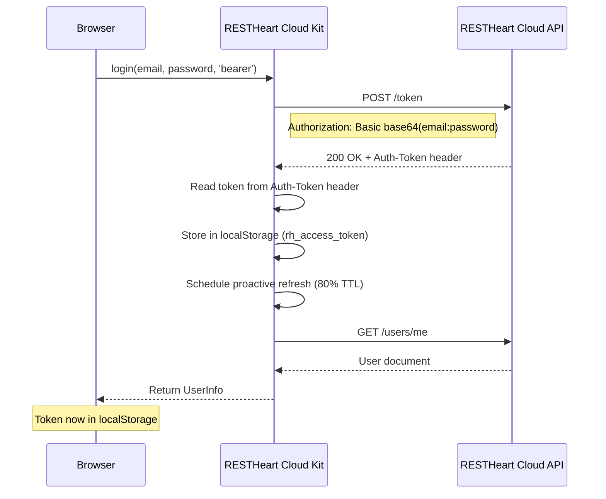
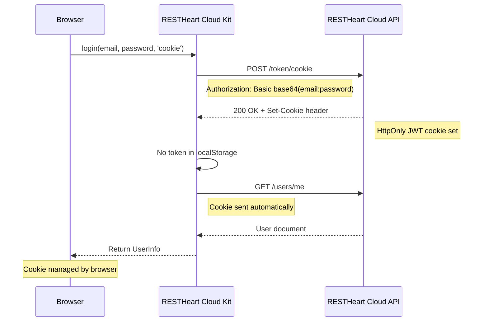
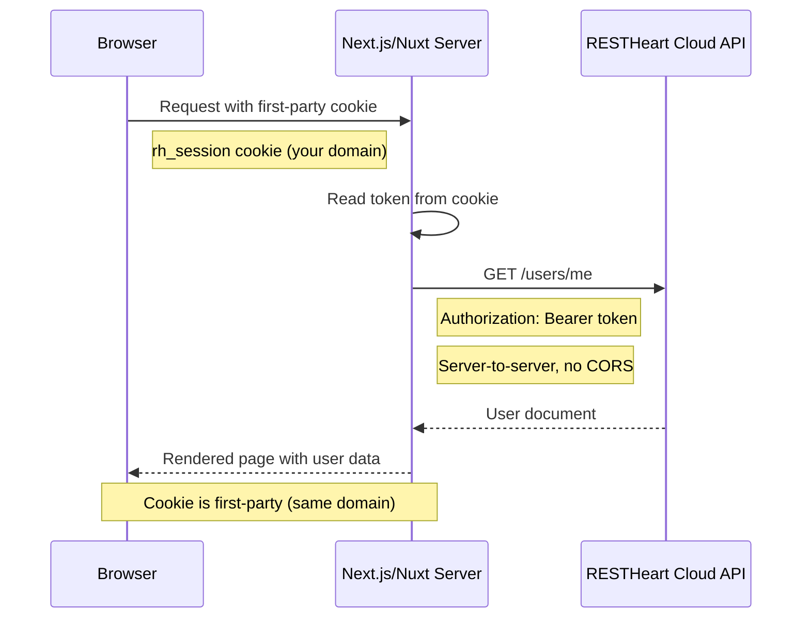
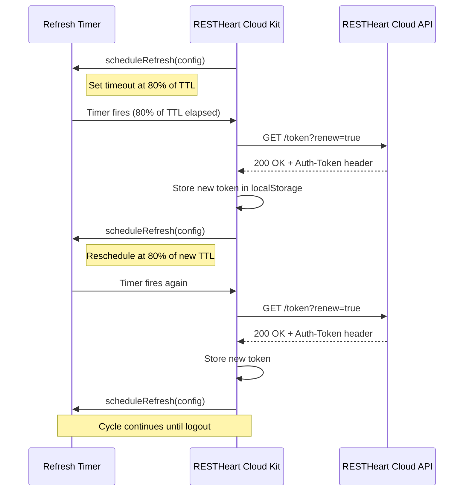

# Token Delivery

This document explains the two authentication modes in RESTHeart Cloud Kit: bearer token and cookie mode. It covers how tokens are delivered, stored, and refreshed, and how SSR frameworks (Next.js, Nuxt) handle token delivery through first-party cookies.

## Overview

RESTHeart Cloud Kit supports two authentication modes:

| Mode | Token Storage | Delivery Mechanism | Use Case |
|------|---------------|-------------------|----------|
| **Bearer** (default) | localStorage (or pluggable source) | `Authorization: Bearer <token>` header | Cross-origin SPAs, SSR frameworks |
| **Cookie** | HttpOnly cookie (RESTHeart-managed) | Automatic cookie | Same-origin only |

**Recommendation**: Use bearer mode unless you have a same-origin setup where the app and API share the same domain.

## Bearer Token Mode

Bearer mode stores the JWT in the client (localStorage by default) and attaches it to every API request via the `Authorization: Bearer <token>` header. This is the standard mode for SPAs and SSR frameworks.

### Bearer Login Flow



### Token Delivery Mechanisms in Bearer Mode

Bearer mode uses two delivery mechanisms depending on the endpoint:

#### Login (`POST /token`)

The token is delivered in the `Auth-Token` response header. The kit reads it with `res.headers.get('Auth-Token')` and stores it in localStorage.

```typescript
// Login — token in Auth-Token header
POST /token
Authorization: Basic base64(email:password)

// Response
HTTP/1.1 200 OK
Auth-Token: eyJhbGciOiJIUzI1NiIsInR5cCI6IkpXVCJ9...
Content-Type: application/json

{ "message": "Login successful" }
```

#### Auto-Login Endpoints

Endpoints like `activate`, `resetPassword`, and `switchTeam` return the token in the JSON response body when `delivery=body` is specified, with the `Auth-Token` header as a fallback. This is handled by `applyBearerDelivery()` from `@restheart-cloud/kit`.

```typescript
// Activate account — token in response body
PATCH /auth/activate?delivery=body

// Reset password — token in response body
PATCH /auth/reset-password?delivery=body

// Switch team — token in response body
POST /auth/switch-team?delivery=body
```

**Response format**:
```json
{
  "access_token": "eyJhbGciOiJIUzI1NiIsInR5cCI6IkpXVCJ9...",
  "token_type": "Bearer",
  "expires_in": 900
}
```

The `applyBearerDelivery()` function extracts the token: it checks the body's `access_token` field first, then falls back to the `Auth-Token` header.

## Cookie Mode

Cookie mode uses RESTHeart's HttpOnly JWT cookie, which is managed entirely by the backend. This mode only works when the app and API share the same origin.

### Cookie Login Flow



### Cookie Delivery Parameter

When using cookie mode, the `delivery=cookie` query parameter tells the backend to set a cookie instead of returning the token in the response:

```typescript
// Login
POST /token/cookie?delivery=cookie

// Activate account
PATCH /auth/activate?delivery=cookie

// Reset password
PATCH /auth/reset-password?delivery=cookie

// Switch team
POST /auth/switch-team?delivery=cookie
```

**Response format** (no token in body):
```json
{
  "message": "Login successful"
}
```

### Cookie Security Properties

- **HttpOnly**: Not accessible to JavaScript
- **Secure**: Only sent over HTTPS (in production)
- **SameSite**: CSRF protection (configurable)

## SSR Frameworks: First-Party Cookie Pattern

SSR frameworks (Next.js, Nuxt) use a different cookie pattern that doesn't require RESTHeart's cookie mode. They manage their own first-party cookies containing the same JWT that SPAs store in localStorage.

### SSR First-Party Cookie Flow



### Key Insight

- **Your server's cookie**: First-party, same domain, always works
- **RESTHeart's cookie**: Third-party, different domain, usually blocked
- **Solution**: Your server manages its own cookie, sends Bearer token to API

**RESTHeart is not aware the cookie exists** — it only sees Bearer tokens.

### Implementation in SSR Adapters

#### Next.js (`@restheart-cloud/kit-react/next`)

The Next.js adapter provides:

1. **`rhServerConfig()`** — Builds an `AuthConfig` whose `getToken` reads from the request cookie
2. **`rhAuthMiddleware()`** — Proactive refresh and route guards in middleware
3. **Server Actions** (`rhLogin`, `rhSwitchTeam`, etc.) — Capture tokens via `setToken` sink and write to cookie
4. **`createSessionRoute()`** — Route handlers for fragment→cookie bridge

```typescript
// Server Component usage
import { getServerSession } from '@restheart-cloud/kit-react/next';

export default async function Page() {
  const user = await getServerSession(config);
  if (!user) redirect('/auth/login');
  return <Dashboard user={user} />;
}
```

#### Nuxt (`@restheart-cloud/kit-vue/nuxt`)

The Nuxt adapter provides equivalent functionality:

1. **`rhServerConfig(event)`** — Builds an `AuthConfig` whose `getToken` reads from the request cookie
2. **`rhAuthServerMiddleware()`** — Proactive refresh and route guards in Nitro middleware
3. **Server Handlers** (`rhLogin`, `rhSwitchTeam`, etc.) — Capture tokens via `setToken` sink and write to cookie

### Token Lifecycle in SSR

1. **Browser → Server**: First-party cookie (`rh_session` on your domain)
2. **Server → API**: Bearer token (server-to-server, no CORS, no browser)
3. **API → Server**: Token in response body (for auto-login endpoints)
4. **Server → Browser**: Updated first-party cookie (via `Set-Cookie`)

## Proactive Token Refresh

Bearer mode implements proactive token refresh to prevent tokens from expiring during user sessions.

### Proactive Refresh Lifecycle



### Refresh Mechanism

- **Timing**: Refresh triggers at 80% of token TTL (e.g., 12 minutes for a 15-minute token)
- **Endpoint**: `GET /token?renew=true`
- **Token storage**: New token replaces old in localStorage
- **Timer management**: Single timer, cleared on logout or session clear

### SSR Refresh in Middleware

In SSR frameworks, proactive refresh happens in middleware (not browser timers):

```typescript
// Next.js middleware
export const middleware = rhAuthMiddleware(config, {
  isProtected: (p) => p.startsWith('/app'),
  refreshThreshold: 0.8, // Default: refresh at 80% of TTL
});
```

The middleware:
1. Decodes the JWT to check `exp` and `iat` claims
2. If the token has passed 80% of its lifetime, calls `/token?renew`
3. Rewrites the `Set-Cookie` header with the renewed token
4. Runs route guards (redirect if protected/unauthenticated)

## Pluggable Token Source/Sink Pattern

The `AuthConfig` interface supports pluggable token sources and sinks for different runtimes:

### Token Source (`getToken`)

Where the bearer token comes from:

- **Browser (default)**: `localStorage.getItem('rh_access_token')`
- **SSR runtimes**: Read from request cookie
- **CLI/Node**: Read from environment or file

```typescript
export interface AuthConfig {
  /** Where the bearer token comes from. Defaults to localStorage. */
  getToken?: () => string | null | Promise<string | null>;
}
```

### Token Sink (`setToken`)

Where a freshly obtained token is persisted:

- **Browser (default)**: `localStorage.setItem()` + schedule refresh timer
- **SSR runtimes**: Capture token for writing to response cookie

```typescript
export interface AuthConfig {
  /** Where a freshly obtained token is persisted. Defaults to localStorage + refresh timer. */
  setToken?: (token: string) => void;
}
```

### SSR Capturing Pattern

SSR adapters use a "capturing" pattern where `setToken` captures the token without touching localStorage:

```typescript
// Next.js server action
async function runCapturing<T>(
  config: AuthConfig,
  opts: SessionCookieOptions,
  run: (cfg: AuthConfig) => Promise<T>
): Promise<T> {
  const store = await cookies();
  const current = store.get(opts.name)?.value ?? null;
  let captured: string | null = null;

  const cfg: AuthConfig = {
    ...config,
    getToken: () => captured ?? current,
    setToken: (t) => { captured = t; },
  };

  const result = await run(cfg);

  if (captured) {
    store.set(opts.name, captured, {
      httpOnly: opts.httpOnly,
      secure: opts.secure,
      sameSite: opts.sameSite,
      path: opts.path,
      maxAge: cookieMaxAge(captured),
    });
  }
  return result;
}
```

## Angular Interceptor

The Angular adapter includes an HTTP interceptor that handles 401 responses and suppresses browser auth challenges.

### 401 Handling

```typescript
export const rhAuthInterceptor: HttpInterceptorFn = (req, next) => {
  const auth = inject(RhAuthService);
  const config = inject(RH_AUTH_CONFIG);

  // Only handle 401s for non-kit requests
  const ownsIts401s = req.context.get(RH_KIT_REQUEST);

  const onError = (source: Observable<unknown>) =>
    source.pipe(
      catchError((err: unknown) => {
        if (!ownsIts401s && err instanceof HttpErrorResponse && err.status === 401) {
          clearToken();
          cancelRefresh();
          auth.clearSession();
        }
        return throwError(() => err);
      })
    );

  // Only attach token to requests to apiBaseUrl
  if (!req.url.startsWith(config.apiBaseUrl)) {
    return next(req).pipe(onError);
  }

  // Attach Bearer token and suppress auth challenge
  const withCredentials = (token: string | null) =>
    next(req.clone({
      setHeaders: {
        ...(token && !req.headers.has('Authorization')
          ? { Authorization: `Bearer ${token}` }
          : {}),
        'No-Auth-Challenge': 'true', // Suppress browser Basic Auth popup
      },
      withCredentials: true,
    })).pipe(onError);

  const token = readToken(config);
  return isPromise(token)
    ? from(token).pipe(switchMap(withCredentials))
    : withCredentials(token);
};
```

### No-Auth-Challenge Header

The `No-Auth-Challenge: true` header suppresses RESTHeart's `WWW-Authenticate` challenge on 401 responses. Without this, browsers show their native Basic Auth popup whenever an unauthenticated request (e.g., a session check) gets a 401.

This header is set by:
- `apiFetch()` in the core kit
- `rhAuthInterceptor` in Angular
- SSR middleware (Next.js, Nuxt)

## Choosing the Right Mode

| Scenario | Mode | Reason |
|----------|------|--------|
| Angular/React/Vue SPA | Bearer | Cross-origin (default) |
| Next.js/Nuxt SSR | Bearer | Server manages its own first-party cookie |
| Same-origin deployment | Cookie | First-party cookie works |
| Mobile app | Bearer | No cookie support |
| Embedded widget | Bearer | Cross-origin |

### When to Use Cookie Mode

**Only when**:
- App and API share the same origin (same domain)
- You want HttpOnly cookie security
- You don't need to read the token in JavaScript

**Example**: Self-hosted RESTHeart where app and API are on the same server.

### When to Use Bearer Mode

**Always when**:
- App and API are on different domains (most cases)
- Using RESTHeart Cloud (*.restheart.com)
- Building SPAs (Angular, React, Vue)
- Building SSR apps (Next.js, Nuxt)
- Need to read token in JavaScript
- Building mobile apps

## Security Considerations

### Bearer Mode Security

**Risks**:
- Token accessible to JavaScript (XSS vulnerability)
- Token in localStorage (persistent)
- Token sent in header (visible in DevTools)

**Mitigations**:
- Use HTTPS
- Implement CSP headers
- Sanitize user input
- Short token TTL (15 minutes)
- Proactive refresh

### Cookie Mode Security

**Benefits**:
- HttpOnly: Not accessible to JavaScript
- Secure: Only sent over HTTPS
- SameSite: CSRF protection

**Risks**:
- Third-party cookie blocking (when app and API are on different domains)
- CSRF attacks (mitigated by SameSite)

### SSR First-Party Cookie Security

**Benefits**:
- First-party cookie (same domain, always allowed)
- HttpOnly: Not accessible to JavaScript
- Secure: Only sent over HTTPS
- SameSite: CSRF protection

**Key advantage**: RESTHeart doesn't need to support cookies — the server exchanges a cookie with itself.

## Implementation Examples

### Bearer Mode in SPA

```typescript
// Login
const user = await login(config, email, password, 'bearer');

// Token stored in localStorage
const token = getToken(); // Returns JWT

// Token attached to requests automatically
await apiFetch(config, '/some-endpoint');
// Sends: Authorization: Bearer <token>
```

### Cookie Mode

```typescript
// Login
const user = await login(config, email, password, 'cookie');

// Token NOT in localStorage
const token = getToken(); // Returns null

// Cookie sent automatically
await apiFetch(config, '/some-endpoint');
// Sends: Cookie: <name>=<jwt>
```

### SSR Server Action (Next.js)

```typescript
// Server action login
import { rhLogin } from '@restheart-cloud/kit-react/next';

export async function loginAction(email: string, password: string) {
  const user = await rhLogin(config, email, password);
  redirect('/dashboard');
}
```

## Troubleshooting

### Token not stored after login

**Bearer mode**:
- Check localStorage in DevTools
- Look for `rh_access_token` key
- Verify no errors in console

**Cookie mode**:
- Check Application → Cookies in DevTools
- Look for RESTHeart cookie
- Verify SameSite and Secure flags

### Requests not authenticated

**Bearer mode**:
- Check Authorization header in Network tab
- Verify token is not expired
- Check CORS configuration

**Cookie mode**:
- Check if cookie is sent (Network tab)
- Verify cookie is not blocked (third-party)
- Check SameSite attribute

### SSR: Cookie not persisted

- Ensure server action runs in a Server Action or Route Handler (not Server Component)
- Check that `cookies()` is writable (not during render)
- Verify cookie name matches `RH_SESSION_COOKIE`

### Token refresh fails

**Bearer mode**:
- Check network connectivity
- Verify RESTHeart Cloud is accessible
- Look for errors in console

**SSR middleware**:
- Check server logs
- Verify middleware runs on the request
- Check `refreshThreshold` configuration

## Related Pages

- [Architecture Overview](./overview.md)
- [Angular Adapter](../packages/kit-ng.md)
- [React Adapter](../packages/kit-react.md)
- [Vue Adapter](../packages/kit-vue.md)
- [Core Kit](../packages/kit.md)
