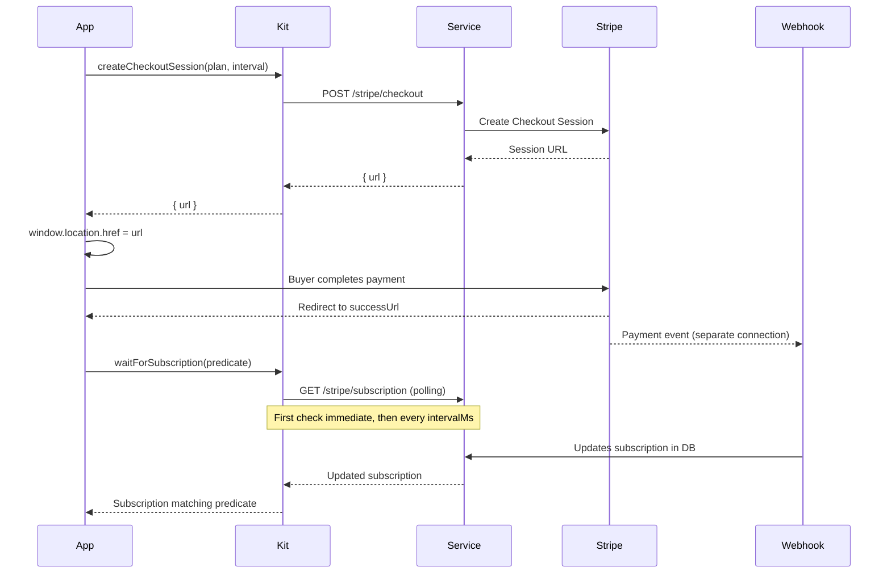
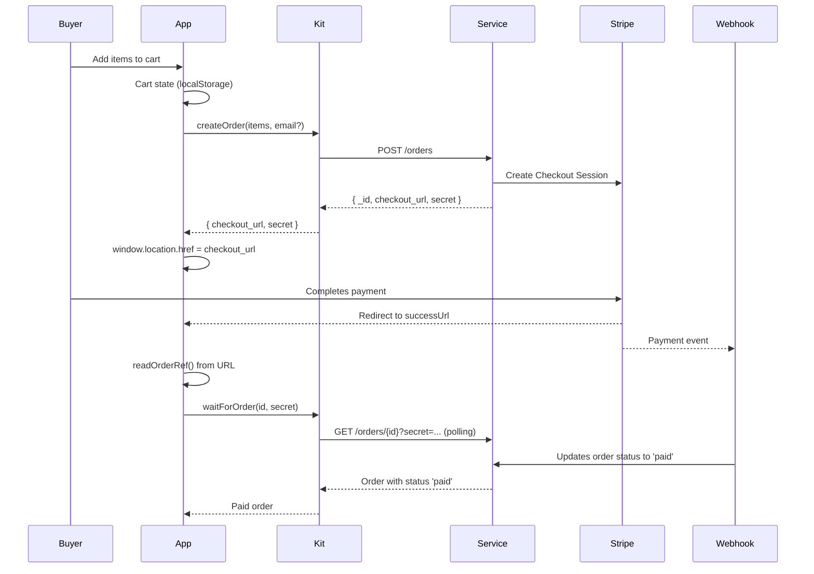
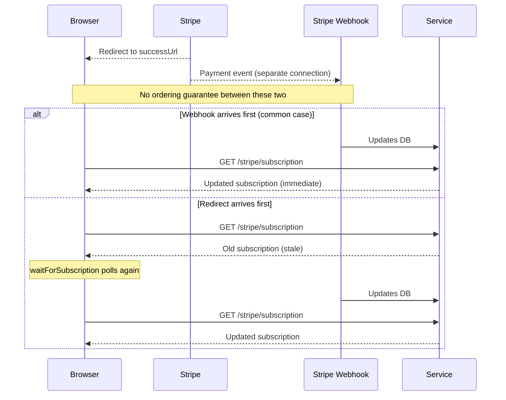
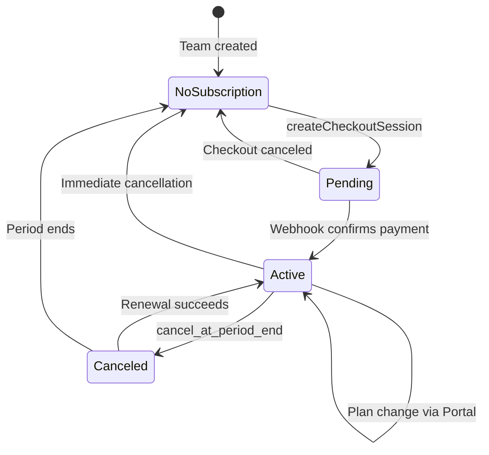
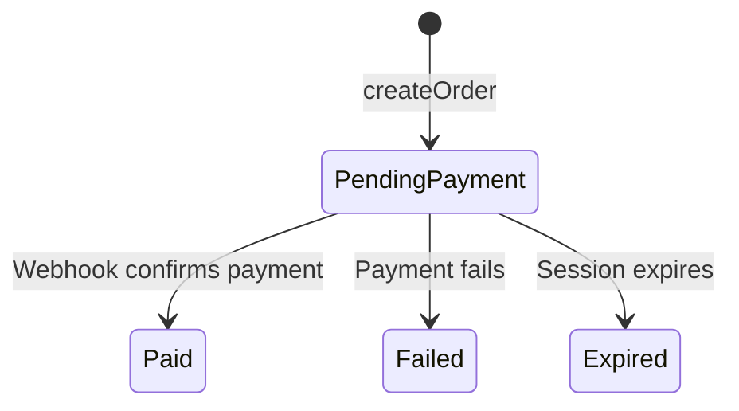

# Payments & E-commerce

The kit's payments subsystem covers two distinct modes — **subscriptions** (plans, checkout, portal, seat licences) and **products** (catalog, orders, guest checkout, cart) — both backed by Stripe via the service's `stripe` plugin. The subsystem is opt-in: without `config.payments = true`, no `/stripe/*` call is ever made.

## Configuration

Payments are enabled explicitly in the auth config:

```ts
const config: AuthConfig = {
  apiBaseUrl: 'https://my-service.restheart.com',
  payments: true,                // explicit opt-in
  ownershipRole: 'owner',        // default, overridable
};
```

When `payments` is `false` or absent (the default), adapters never call `/stripe/*` — a service without the `stripe` plugin would respond `404` on those paths, and this flag prevents that from happening on every app startup.

The `ownershipRole` config field (default `'owner'`) determines who can manage billing. It derives `canManageBilling` by comparing the current user's `team.role` against this value. **Must match the service's `accountsConfig.ownership-role`** — if the deployment overrides it (via `override-accounts-ownership-role`), hardcoding `'owner'` would show the billing button to the wrong people and hide it from the right ones.

<a id="subscriptions"></a>

## Subscriptions

### Plans & subscription state

The subscription plan catalog is public (no session required) — `getPlans()` calls `GET /stripe/plans`, which the service's `StripePlansService` does not gate on authentication. A deployment that wants the catalog itself private would need its own ACL rule.

The team's subscription is readable by any team member via `getSubscription()` (`GET /stripe/subscription`). Unlike checkout, portal, and licence operations, it is **not** gated on `canManageBilling` — a member who cannot change the plan can still see it.

### Checkout & portal

`createCheckoutSession(plan, interval)` starts a Stripe Checkout session and returns a URL to redirect to (`window.location.href = url`). Requires `canManageBilling`. **Rejects with `status: 409`** when the team already has an active subscription — Checkout does not do upgrades/downgrades, only new subscriptions. Send an already-subscribed team to `openBillingPortal()` instead, where Stripe's own UI handles the plan change.

`openBillingPortal()` opens the Stripe Customer Portal for self-service plan changes, payment method management, and cancellation. **Rejects with `status: 402`** for a team that has never checked out: the Portal has nothing to manage without a Stripe Customer behind it. Route a `402` to `createCheckoutSession` instead of retrying the Portal.

### Seat licences

Plans can declare seat modes: `capped` (fixed maximum), `per_seat` (billed per seat, optional ceiling), or `unlimited`. The licence functions (`getLicenses`, `grantLicense`, `revokeLicense`) all require `canManageBilling`.

`grantLicense(userId)` returns `'granted'` (201) or `'already-licensed'` (200). It rejects with `status: 404` (no such member) or `status: 409` (no seat available), both distinguishable on `ApiError.status`.

<a id="e-commerce"></a>

## Products & Orders

### Catalog

`getCatalog(config, opts?)` reads the product catalog — a plain MongoDB collection read, not a dedicated endpoint. The collection name is configurable on the service side (default `catalog`), so it is parameterized, not hardcoded. Access control is entirely the deployment's own ACL (a `readFilter` restricting to `purchasable: true`, pagination, projections — none of that is the kit's to decide).

The `CatalogQuery` options support pagination (`pagesize`, `page`), server-side filtering (`filter` as a MongoDB query object), and sorting (`sort`). Filtering happens server-side because a paged list cannot be filtered client-side without missing items on other pages.

### Orders

`createOrder(config, items, email?, collection?)` creates an order and starts Checkout. Prices come from the server's catalog (`catalogItem.unitAmount`), resolved from `productId` at the moment of the call — never from anything the client sends, so there is no client-suppliable price to tamper with.

The `email` parameter enables **guest checkout**: the deployment's ACL decides whether an unauthenticated request is allowed at all. When the caller is authenticated, omit it.

`getOrder(config, id, secret?, collection?)` reads an order back. The `secret` is the guest checkout path: no session, the secret proves ownership instead. Harmless to pass alongside a session too — `apiFetch` still attaches the bearer token if there is one.

### Order reference from Checkout return URL

Stripe substitutes only `{CHECKOUT_SESSION_ID}` in the success URL, so on its own the return page learns nothing about which order it is showing. RESTHeart's `stripe` plugin fills that gap: configure `products.success-url` with `{ORDER_ID}` and `{ORDER_SECRET}` and it interpolates them when it creates the session.

```
success-url: https://shop.example.com/order#order={ORDER_ID}&secret={ORDER_SECRET}
```

`readOrderRef(url?)` reads the fragment first, then the query string — because the fragment is the recommended placement. A fragment never leaves the browser: it is absent from access logs, proxy logs, and `Referer` headers, which matters because the secret is a bearer credential. `clearOrderRef()` strips the reference from the address bar immediately after reading.

<a id="cart"></a>

## The Cart

The cart is a **pure client-side data structure** — nothing in it talks to a server. It belongs to the browser, not to a session, and a shop that makes people sign in before they can put something in a basket loses most of them there. It becomes an order — which does need a config — when `toOrderItems(lines)` is handed to `createOrder`.

Every cart function is pure and takes the lines it works on, returning a new array (never mutating the input). This means a cart can live in React state, a Vue ref, an Angular signal, or a plain variable. The framework packages wrap these pure functions; they do not reimplement them.

### Cart lines

Each `CartLine` has:
- `productId` — unique identifier, composite for variants (e.g. `tee-classic/yellow-l`)
- `quantity` — always at least 1
- `name`, `unitAmount`, `currency` — **display only**: the service reads prices from its own catalog at checkout time
- `options` — variant selections (e.g. `{ colour: 'yellow', size: 'L' }`), which travel as `metadata` on the order line
- `image` — for display in the cart UI

### Storage

The cart is backed by `localStorage` (key defaults to `'rh-cart'`). `loadCart` returns `[]` for anything it cannot make sense of, and drops individual lines that are malformed — `localStorage` is a place other code writes too, survives a deploy that changed the shape, and can be edited by hand. `saveCart` does nothing if storage is full or blocked (private browsing, quota) — not worth failing a checkout over.

On the server, `localStorage` does not exist and the cart reads as empty. That is correct for a rendered page — a request carries no basket — but it does mean a server-rendered cart count starts at zero and fills in once the browser takes over.

### Converting to order items

`toOrderItems(lines)` strips names, prices, and pictures — the service reads those from its own catalog. The chosen options do travel as `metadata`, because the service cannot infer them: a variant reference identifies which row of the catalog was bought, not which of its fields the seller wants to read on a packing slip.

<a id="price-formatting"></a>

## Money Formatting

`formatPrice(amountMinorUnits, currency, locale?)` formats a Stripe amount (always in the currency's minor unit) as a localized price string.

**`amount / 100` is the bug this function exists to prevent.** Not every currency has 2 decimal digits:
- JPY has 0: `¥500`, not `¥5.00`
- BHD (Bahraini dinar) has 3: `BHD 19.900`, not `BHD 19.90`
- EUR/USD have 2: `€19.90`, `$1.00`

`Intl.NumberFormat`'s `currency` style already knows each currency's own digit count — it is platform, not a dependency — so `formatPrice` delegates to it instead of hand-rolling the division.

```ts
formatPrice(1990, 'eur')           // "19,90 €" (browser default locale)
formatPrice(500, 'jpy', 'ja-JP')   // "¥500"
formatPrice(19900, 'bhd', 'en-BH') // "BHD 19.900"
```

## Key Design Decisions

### No token renewal after plan change

Every other write in the kit that changes what a Guards rule sees (`acceptConsents`, `switchTeam`, `updateProfile`) renews the token afterwards, because the guard reads the JWT. Subscriptions do not: `@subscription` is resolved server-side from the database on every request, cached only for the life of that request (`SubscriptionVarResolver`). An upgrade is therefore effective immediately, with no re-login and no `renewToken` call. Copying the consents pattern here would add a needless round trip on every checkout.

### The redirect races the webhook

After Checkout, Stripe sends the buyer back to `successUrl` over the browser; it reports the payment over a separate server-to-server webhook, with no ordering guarantee between the two. A page that calls `getSubscription` or `getOrder` the moment it mounts can read the old state — not a bug, just too early.

The fix is `waitForSubscription` and `waitForOrder`: polling functions that check immediately (no initial delay — the common case is that the webhook already landed), then poll at a configurable interval until a predicate is satisfied or a timeout is reached.

**Timing out is not a payment failure.** Stripe already has the money; only the webhook that would reflect it here is late. Both functions reject with `WaitTimeoutError`, kept deliberately separate from `ApiError` so "you're not subscribed" (an `ApiError`) and "you are, we just haven't heard yet" (a `WaitTimeoutError`) never collapse into the same error screen.

```ts
// On the Checkout success page, after starting a checkout for 'gold'
const sub = await waitForSubscription(config, s => s.plan === 'gold' && s.active);

// On the order success page
const order = await waitForOrder(config, orderId, secret);
if (order.status === 'paid') showConfirmation(order);
```

### Prices in the cart are display-only

The cart stores `unitAmount` and `name` for display purposes. The service reads `unitAmount` from its own catalog when it builds the Checkout session, so a tampered line changes what the buyer sees and nothing about what they are charged.

## Subscription Checkout Flow



*Subscription checkout flow: the buyer is redirected to Stripe, then `waitForSubscription` polls until the webhook updates the database.*

## Order Flow



*Order flow: cart items become an order, Checkout handles payment, `waitForOrder` polls until the webhook confirms.*

## Webhook Race Condition



*The webhook race: the browser redirect and the webhook have no ordering guarantee. `waitForSubscription`/`waitForOrder` handle both cases.*

## Framework Adapters

### React

**Payments:** `RhPaymentsProvider` wraps the app and provides `usePayments()`. Must be inside an `RhAuthProvider`. Automatically loads the subscription on sign-in and team switch, clears it on sign-out.

```tsx
<RhAuthProvider config={config}>
  <RhPaymentsProvider config={config}>
    <App />
  </RhPaymentsProvider>
</RhAuthProvider>
```

**Cart:** `RhCartProvider` wraps the app and provides `useCart()`. Independent of auth — a cart belongs to the browser, not a session. Two apps on the same origin can be kept apart by setting different `storageKey` props.

```tsx
<RhCartProvider storageKey="my-shop">
  <App />
</RhCartProvider>
```

### Angular

**Payments:** `RhPaymentsService` is an injectable service. Automatically loads the subscription via an `effect` watching `teamKey`. All methods return `Observable`.

```ts
@Injectable({ providedIn: 'root' })
export class MyComponent {
  private payments = inject(RhPaymentsService);
  plan = this.payments.plan; // signal
}
```

**Cart:** `RhCartService` is an injectable service. Storage key is configurable via `RH_CART_STORAGE_KEY` injection token. Independent of auth — a cart belongs to the browser, not a session. Two apps on the same origin can be kept apart by providing different storage keys.

```ts
// In your app config or a shared module
providers: [
  { provide: RH_CART_STORAGE_KEY, useValue: 'my-shop' }
]

@Injectable({ providedIn: 'root' })
export class MyComponent {
  private cart = inject(RhCartService);
  items = this.cart.lines; // signal
}
```

### Vue

**Payments:** `createRhPayments(config, auth)` returns a Vue plugin. Register with `app.use(rhPayments)`, then access anywhere with `usePayments()`.

```ts
const rhAuth = createRhAuth(config);
const rhPayments = createRhPayments(config, rhAuth);
app.use(rhAuth);
app.use(rhPayments);
```

**Cart:** `createRhCart(storageKey?)` returns a Vue plugin. Register with `app.use(rhCart)`, then access anywhere with `useCart()`. Independent of auth — a cart belongs to the browser, not a session. Two apps on the same origin can be kept apart by passing different storage keys.

```ts
const rhCart = createRhCart('my-shop');
app.use(rhCart);
```

## Adapter Contract (Section E)

The adapter test contract (`docs/ADAPTER_CONTRACT.md`) defines the payments test scenarios that every SPA adapter must implement:

| # | Scenario | Expected |
|---|---|---|
| E1 | bootstrap without `payments` in config | no call to `/stripe/*`; `subscription=null`, `plan=null`, `isSubscribed=false`, `seatsAvailable=null` |
| E2 | bootstrap with `payments`, session valid | loads `subscription` after user and teams |
| E3 | `login` with `payments` | loads `subscription` in the same flow |
| E4 | `switchTeam` | reloads `subscription` (the subscription belongs to the team) |
| E5 | `logout` | clears `subscription` along with user and teams |
| E6 | `clearSession` | clears `subscription` along with user and teams |
| E7 | `canManageBilling` | `true` iff `user.team.role` equals the configured `ownershipRole` (default `'owner'`); a case with a custom `ownershipRole` must be covered |
| E8 | `checkout` returning `409` | the error reaches the caller with `status: 409`, state does not change |
| E9 | `waitForSubscription` resolves | updates `subscription` with the new value |
| E10 | `updateProfile` / `acceptConsents` | **no** reload — both re-run `checkSession` and hand back a fresh user document, but the team has not changed. Key the reload on the team id, not on the user object's identity |

Section E is reactive client state, which the SSR surfaces (`*/next`, `*/nuxt`) do not have — they are session, cookie, and middleware helpers that run before render. Nothing in E1–E10 has a server-side counterpart, so those surfaces are `not applicable` rather than `pending`.

## Subscription Lifecycle



*Subscription states: transitions are driven by Stripe webhooks, not client-side actions.*

## Order Status Lifecycle



*Order statuses: `pending_payment` is the initial state, moved forward by Stripe's webhook — never by the client's redirect.*
