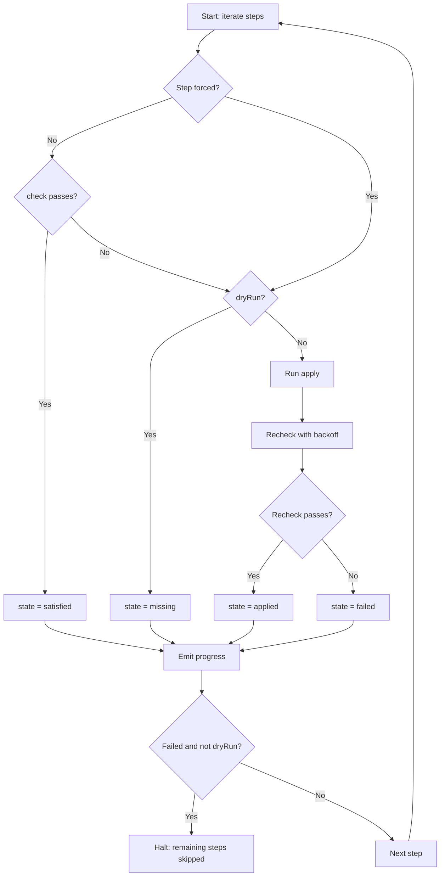
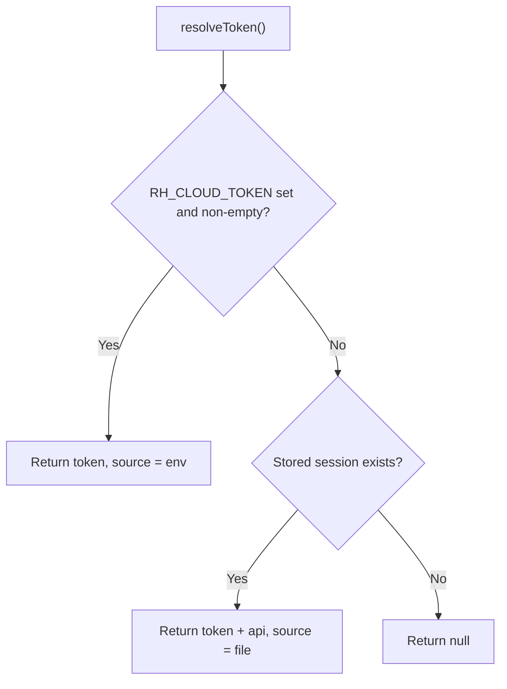

# @restheart-cloud/cli

The `@restheart-cloud/cli` package provides both a command-line tool (`rhc`) and a library for configuring RESTHeart Cloud services from a declarative setup file committed to version control. It turns manual console clicks — creating collections, writing ACL permissions, installing and configuring plugins — into a repeatable, idempotent, dry-runnable script.

## Installation

Two install shapes, because there are two things here used at different moments:

```bash
npm i -g @restheart-cloud/cli    # the `rhc` command, for a terminal
npm i -D @restheart-cloud/cli    # the library, for a project whose setup file imports it
```

A setup file imports `defineSetup`, `step`, and `fromEnv`, so a project that has one wants the local dependency — a global install is not on Node's module resolution path and the import would not resolve. The `rhc` command is account-level and outlives any one project, so it wants the global one. Installing both is normal, the same way `vite` is both a bin and the module `defineConfig` comes from.

In a pipeline, neither: `npx @restheart-cloud/cli setup …` and nothing to keep installed.

The two copies do not conflict. `fromEnv` markers are matched with `Symbol.for`, which is the global symbol registry rather than a per-module identity, and a `Setup` is plain data — `{ name, steps: [{ name, check, apply }] }` — no `instanceof`, no shared class. So the `rhc` you have installed can run a setup built against a different version of the library.

## Node only, and not by accident

The admin node's `originVetoer` whitelists `cloud.restheart.com` and allows a *missing* `Origin` header. A page served from your own origin sends one and is vetoed; Node, curl, and anything that is not a browser pass. So this is a CLI and a library for Node, and designing it as a browser page would have produced an API that cannot work.

It is also the right call on its own merits: the credential here is your RESTHeart Cloud account, which governs every service you own and its billing — a much larger blast radius than the tenant token the framework adapters handle, and not a thing to put in a deployed page.

This is **not a fourth adapter**. There is no reactive state, no session to restore, no signal to update.

## Source Map

| File | Responsibility |
|---|---|
| `src/cli.ts` | CLI entrypoint — `rhc login`, `rhc logout`, `rhc setup` commands, argument parsing, setup file loading, progress rendering |
| `src/admin.ts` | Admin-node client (`createAdminClient`) — plugin management, service token minting, `fromEnv` resolution during serialization |
| `src/service.ts` | Service-node client (`createServiceClient`) — collection, index, permission, user, and schema CRUD; lazy token minting with automatic renewal |
| `src/setup.ts` | Setup runner — `step`, `defineSetup`, `runSetup`; sequential execution with check/apply halves, recheck backoff, dry-run, force |
| `src/session.ts` | Token persistence — `~/.config/restheart/session.json` (mode 0600), `RH_CLOUD_TOKEN` env var precedence |
| `src/env.ts` | Secret handling — `fromEnv` markers, `resolveEnvRefs`, `MissingEnvError`; Symbol.for identity for cross-version interop |
| `src/http.ts` | Low-level HTTP helpers — `request` (service-node fetch), `existsOr404`, `isApiError` |
| `src/types.ts` | Shared types — `PluginConfig`, `ConfigSchema`, `CatalogPlugin`, `InstalledPlugin`, `ServiceToken`, `REDACTED`, `isRedacted` |
| `src/index.ts` | Library public API — re-exports from all modules |

## The Step Model

The unit of configuration is not an operation, it is a **step**: a `check` that answers satisfied-or-not, and an `apply` that makes it so.

```ts
import { defineSetup, step } from '@restheart-cloud/cli';

export default defineSetup('Blog', [
  step('posts collection', {
    check: ({ service }) => service.collectionExists('posts'),
    apply: ({ service }) => service.createCollection('posts'),
  }),
  step('posts are indexed by slug', {
    check: ({ service }) => service.indexExists('posts', 'slug_unique'),
    apply: ({ service }) => service.createIndex('posts', 'slug_unique', { slug: 1 }, { unique: true }),
  }),
]);
```

That shape gives idempotency, resumability, a dry run, and a progress report for free, because they are all the same thing seen from different angles.

A step receives `{ service, admin, srvId }` — both clients, because plugin install, config, and init are admin-node operations while collections and permissions are service-node ones.

### Step States

| State | Meaning |
|---|---|
| `satisfied` | The check passed. Nothing was done, and nothing needed to be. |
| `applied` | The check failed, the apply ran, the re-check passed. |
| `missing` | A dry run found this undone. |
| `failed` | The apply threw, or ran and left the check still failing. |
| `skipped` | An earlier step failed, so this one was not attempted. |

### Setup Runner Flow



The setup runner flow: check → apply → recheck with exponential backoff.

The runner **re-checks after applying**, so a step that silently did nothing is reported failed rather than green. A real run halts on a failure, because configuration has real dependencies — no index before its collection, no plugin config before the plugin is installed. A dry run does not halt: it changed nothing, and being told all of what is missing is the point.

### Recheck Backoff

The re-check after an apply uses exponential backoff (delays of 0, 300ms, 700ms, 2s, 4s, 8s — up to ~15 seconds total). This handles the case where an apply and its check speak to different processes: installing a plugin runs on the admin node, which writes to the tenant's database; the check then asks the service node, which caches collection metadata. A step that genuinely worked can be observed as not-yet-done, and the backoff buys a slow one the time to finish without turning a wrong step into a passing one.

### Force Mode

`--force` skips the check but not the recheck verification. Named steps can be forced individually (`--force catalog`), matching by case-insensitive substring. Bare `--force` forces all steps, which is usually the wrong tool: an apply written to run once may not survive running twice — installing a plugin answers `409` the second time.

## Secrets with `fromEnv`

A setup lives in git. `fromEnv` is how it names a secret without holding one:

```ts
step('stripe configured', {
  check: async ({ admin, srvId }) => /* ... */,
  apply: ({ admin, srvId }) => admin.updatePluginConfig(srvId, 'stripe', {
    'secret-key': fromEnv('STRIPE_SECRET_KEY'),
    'success-url': 'https://shop.example.com/shop/order',
  }),
});
```

`fromEnv` returns a marker, not a string. It becomes a value in exactly one place — while the client serialises the request body — so the secret never reaches the run report, and a dry run never resolves one at all. An unset variable fails the step with `missing STRIPE_SECRET_KEY`: the *name*, which is not a secret, rather than `undefined` sent to the provider and a rejection three steps later that reads like a bad key instead of an absent one.

### How `fromEnv` Markers Work

The marker uses `Symbol.for('@restheart-cloud/cli:fromEnv')` for identity, which is the global symbol registry rather than a per-module identity. This is what allows the globally-installed `rhc` binary to recognise markers created by a locally-installed copy of the library — a `Symbol()` in place of `Symbol.for` would break it silently.

The marker carries:
- A `toString()` that prints `fromEnv(VAR_NAME)` — the variable name, never a value
- A `toJSON()` that throws — the backstop against `JSON.stringify` on an unresolved marker, which would otherwise succeed and quietly emit `{"name":"STRIPE_SECRET_KEY"}` where the secret should be

Resolution happens at serialization time, inside `resolveEnvRefs`, which walks the value tree replacing markers with environment values. Both the admin client (`updatePluginConfig`) and the service client (`body()` helper) resolve markers on the way out. A dry run never calls `apply`, so markers are never resolved.

`MissingEnvError` collects *every* missing variable before throwing, so a pipeline that is short three secrets learns all three from one run.

### Reading Plugin Config Back

`GET .../config` replaces every `format: password` field with a fixed-width `••••••••` — fixed width because a secret's length is still a leak. `PATCH` replaces the *whole* document and restores the stored value for any field still holding that placeholder.

So read-modify-write is safe exactly as long as you pass the placeholder through untouched:

```ts
const config = await admin.getPluginConfig(srvId, 'stripe');
await admin.updatePluginConfig(srvId, 'stripe', { ...config, 'success-url': next });
```

Do not diff, do not strip "empty-looking" fields, do not normalise — any of those writes bullets over the real key. `REDACTED` and `isRedacted()` are exported so you can *recognise* one; nothing in this package ever produces one.

A blank or absent secret is **not** redacted, because "not configured" is information you need, and turning it into bullets would erase it.

## Session Management and Credential Resolution



Credential resolution chain: `RH_CLOUD_TOKEN` always wins over stored session.

The credential is a **personal access token**. Issue one at [cloud.restheart.com](https://cloud.restheart.com), under your profile.

```bash
rhc login                     # prompts, stores 0600 under ~/.config/restheart
rhc setup --srv ea820b
rhc logout                    # forgets it here; revoke it in the console
```

The CLI has no way to accept a password, and that is the design rather than a gap. If you signed up with Google or GitHub you have no password to give it — the OAuth flow returns no token, only an httpOnly cookie, so nothing outside a browser can complete it. And an account password is the wrong thing to hand a pipeline in any case: it reaches billing and every service you own, and revoking it means changing it everywhere it is used.

A token is narrower on both counts. It carries a derived `cli` role instead of yours, so it configures services and **cannot buy or cancel one**, touch your account, or manage your team — and that is enforced by the server's access rules, not by this CLI choosing to behave. And you revoke one token by itself, without disturbing anything else the account is used for.

### Stored Session

The session is stored at `~/.config/restheart/session.json` (or under `XDG_CONFIG_HOME` when set), with mode `0600` on both the directory and the file. The session records both the token and the admin node it was verified against, because a token issued by `cloud-api.restheart.com` means nothing to any other node — a session that remembered only the token would happily send a production credential at whatever `--api` came next.

A corrupt or unparseable session file reads as absent rather than as an error: the cure is `rhc login`, and refusing to run until the user finds and deletes a file they have never heard of helps nobody.

### `RH_CLOUD_TOKEN` Precedence

**`RH_CLOUD_TOKEN` wins over the stored file, always.** A pipeline has no `rhc login` step, so a CI run must never quietly fall back to a session left behind on a shared runner; and on a developer's machine, an environment variable set on purpose must not be shadowed by a login from last month. Precedence in one direction, with no condition attached, is the only version of this that is predictable.

Never a flag — a credential in a flag is a credential in the shell history, and in the process list of every other user on the machine.

## CLI Commands

```
rhc login  [--api <url>]
rhc logout
rhc setup --srv <id> [options]

--file <path>   A module exporting a setup (default export, or `setup`).
                A function export is called with no arguments.
                Defaults to ./rhc.setup.ts in the working directory.
--srv <id>      The service to set up.
--dry-run       Run every check, apply nothing, write nothing.
--force <name>  Apply the steps whose name contains <name> without asking
                their check first. Repeatable. Bare --force takes every step.
--api <url>     Admin node (default https://cloud-api.restheart.com).
--json          Emit the report as JSON instead of a step list.
--version, -v   Print the version and exit.
```

### `rhc login`

Checks the token against the admin node before storing it. Writing an unverified credential to disk only moves the failure to the next command, where it lands as a `401` in the middle of something you cared about instead of while you can still paste the right thing. The stored session records which admin node the token was verified against, and a `--api` that disagrees is refused rather than sent — otherwise a production credential would be offered to whatever host happened to be named.

Warns if the token does not look like a personal access token (they start with `rhc_live_`), because a service admin token lives fifteen minutes and storing one here means it stops working before you use it.

### `rhc logout`

Removes the stored session file. Does not revoke the token — revoking is a separate act done at cloud.restheart.com.

### `rhc setup`

Loads a setup file (default: `./rhc.setup.ts`), resolves credentials, verifies the token, and runs every step sequentially. The setup file can export a `Setup` object as its default export or as a named `setup` export; a function export is called with no arguments.

A `.ts` setup needs a runtime that can load one — Node 22.18+ strips types on its own, anything earlier wants `npx tsx`.

### Exit Codes

| Exit code | Meaning |
|---|---|
| `0` | Every step satisfied or applied. |
| `1` | A step failed. |
| `2` | A dry run found work outstanding — configuration drift, not an error. |

`--dry-run` in a pull-request check and a full run on merge gives you a deploy **gate**: a misconfigured Stripe key fails the pipeline before it can report success.

## Admin Client

`createAdminClient(config)` creates a client over the admin node (`cloud-api.restheart.com`), taking the core's `AuthConfig` plus an optional `env` source for `fromEnv` resolution.

The client manages its own token in a closure (not `localStorage`, which does not exist in Node), so two clients in one process cannot overwrite each other's session. It silences the core's stderr error logging and reports failures itself, in sentences.

### Methods

| Method | Purpose |
|---|---|
| `login(email, password)` | Authenticate as the RESTHeart Cloud account |
| `useToken(token)` | Set a personal access token (no round trip) |
| `verifyToken()` | Cheap authenticated read (`GET /plugins`) to validate the credential |
| `pluginCatalog()` | Marketplace catalog with `config_schema` for each plugin |
| `listPlugins(srvId)` | Installed and available plugins for a service |
| `isPluginInstalled(srvId, pluginId)` | Whether a plugin is installed (derived from `listPlugins`) |
| `configSchema(srvId, pluginId)` | A plugin's schema from the `available` list (works for uninstalled plugins) |
| `getPluginConfig(srvId, pluginId)` | Stored config with secrets replaced by `REDACTED` |
| `updatePluginConfig(srvId, pluginId, config)` | Replace config; resolves `fromEnv` markers during serialization |
| `installPlugin(srvId, pluginId)` | Install a free plugin (server builds initial config; no body accepted) |
| `uninstallPlugin(srvId, pluginId)` | Remove a plugin |
| `enablePlugin` / `disablePlugin` | Toggle a plugin |
| `initPlugin(srvId, pluginId, mode?)` | Run a plugin's own initialization |
| `testPlugin(srvId, pluginId)` | Validate config against the real provider |
| `serviceToken(srvId)` | Mint a service-admin JWT and get the service URL |
| `fetch(path, init?)` | Escape hatch for uncovered admin endpoints |

`installPlugin` takes no configuration — the server builds the initial document itself and ignores a body, so configuring is always a second step. Free plugins only; a paid one answers `400` and points at `/purchase`, which moves money and is deliberately out of reach.

## Service Client

`createServiceClient(admin, srvId)` creates a client over a service node, derived from the admin client because that is where its token comes from.

### Lazy Token Minting and Renewal

`/jwt` mints a **fifteen-minute** token, and a run that installs a plugin, waits for its `init`, and then writes permissions can outlive that. So the client owns it: fetched lazily, cached, renewed a minute before expiry, shared between concurrent callers, never returned. A caller handed a token would die mid-run with a `401` that reads like a permissions problem, against a service left half-configured.

### Methods

| Check | Apply |
|---|---|
| `collectionExists(name)` | `createCollection(name, meta?)` |
| `indexExists(coll, id)` | `createIndex(coll, id, keys, opts?)` |
| `permissionExists(id)` | `putPermission(id, doc)` |
| `userExists(id)` | `createUser(id, doc)` |
| `schemaExists(coll)` | `putSchema(coll, schema)` |

Plus `fetch(path, init?)` for what that table does not cover, and `url()` to get the service base URL once a token has been minted.

A check answers `false` on `404` and throws on anything else — a `403` means the token cannot see the thing, which is not the same as the thing not being there, and swallowing it would report "missing", apply, and fail again.

Document writes (permissions, users, schemas) use `?wm=upsert` because RESTHeart's default write mode is `update`, and updating a document that is not there answers `404` rather than creating it. Collections and indexes create on their own without upsert.

The service client also resolves `fromEnv` markers in request bodies, just as the admin client does — a user document has a password, a permission can carry a token.

## From a Pipeline

Set `RH_CLOUD_TOKEN` from your platform's secret store. There is no `rhc login` step: the variable **always wins over a stored session**, in that direction and with no condition attached, so a CI run can never quietly fall back to a session left behind on a shared runner.

```yaml
# .github/workflows/deploy.yml
- run: npx @restheart-cloud/cli setup --srv ea820b
  env:
    RH_CLOUD_TOKEN: ${{ secrets.RH_CLOUD_TOKEN }}
    STRIPE_SECRET_KEY: ${{ secrets.STRIPE_SECRET_KEY }}
    STRIPE_WEBHOOK_SECRET: ${{ secrets.STRIPE_WEBHOOK_SECRET }}
```

A revoked or expired token is reported as exactly that rather than as a bare `401`, and the message differs by where the token came from: a pipeline is told to update its secret store, a terminal is told to run `rhc login`.

Both platforms mask a registered secret in their own logs, but that is their safety net and not this package's: the progress callback emits a step's name and state and nothing else, so there is nothing of the secret to mask.

## Out of Scope

- **Creating services.** Provisioning is the console's job; this configures one that exists. `rhc new free|shared` is specified but not built.
- **Billing.** `/purchase`, `/cancel`, and `/invoices` move money. A wizard that can spend your money by accident is not a wizard.
- **A hosted configuration page.** Ruled out by the `originVetoer`. A local page served *by* the CLI would talk to the CLI's own process, and is a reasonable later addition.
- **Editing arbitrary RESTHeart configuration.** Only plugin config.
