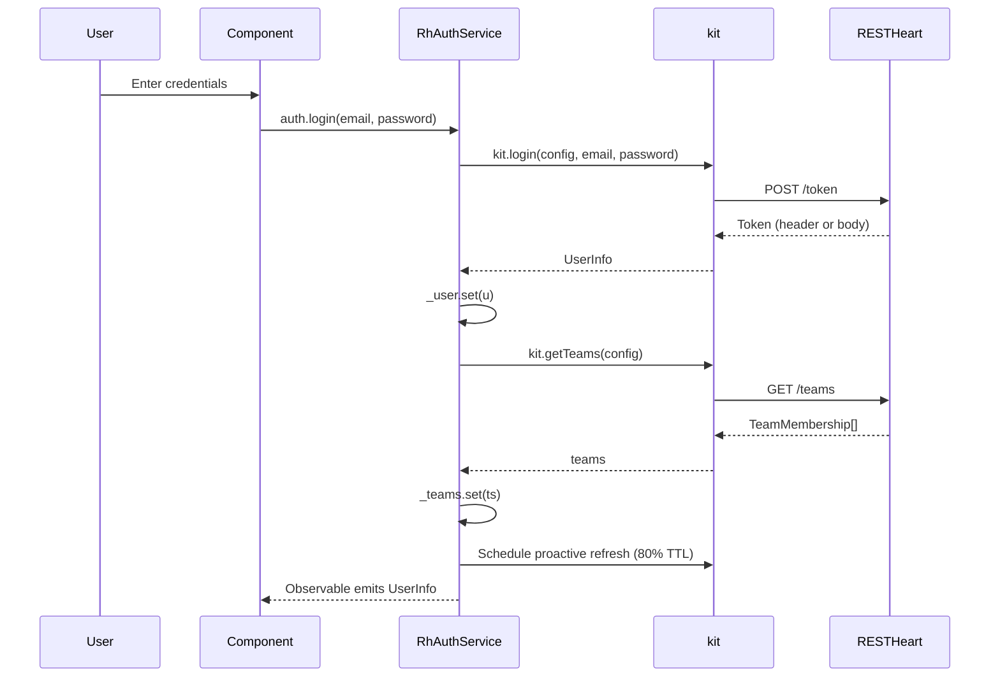
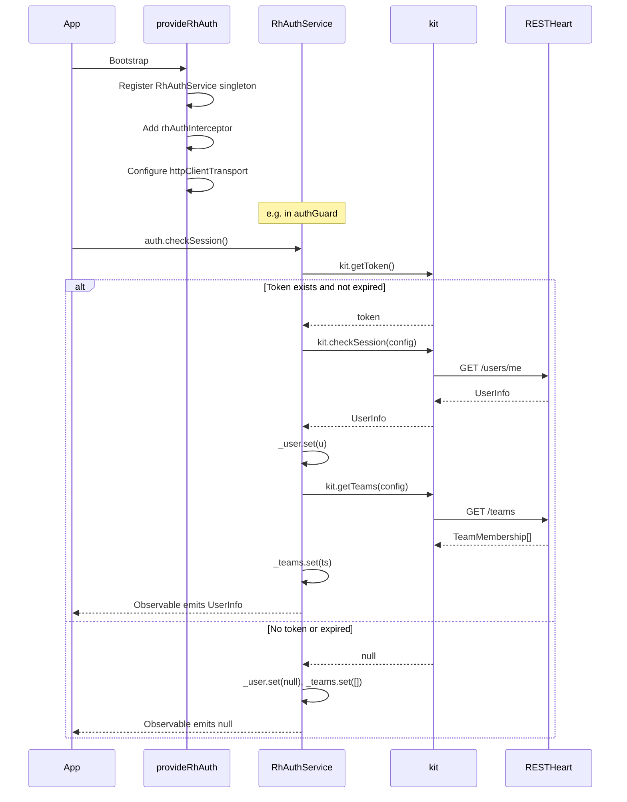
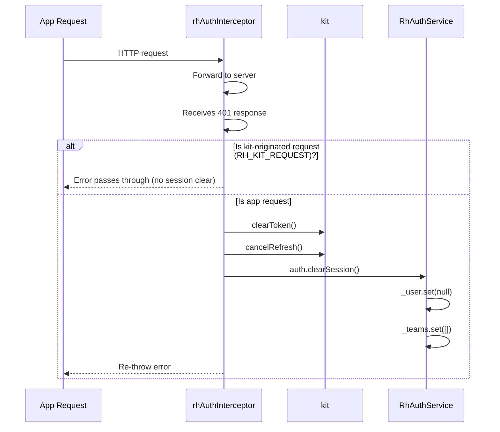

# @restheart-cloud/kit-ng

Angular adapter for `@restheart-cloud/kit`. Wraps the core authentication, payments, and cart logic in Angular services with signals, route guards, and an HTTP interceptor.

## Installation

```bash
npm install @restheart-cloud/kit-ng @restheart-cloud/kit
```

**Requirements**:
- Angular 21+ (peer dependency)
- RxJS 7+ (peer dependency)
- RESTHeart 9.6.0+ (for `delivery=body` support)

## Quick Start

### 1. Setup Provider

In `app.config.ts`:

```typescript
import { provideRhAuth } from '@restheart-cloud/kit-ng';

export const appConfig: ApplicationConfig = {
  providers: [
    provideRhAuth({ apiBaseUrl: environment.apiUrl }),
  ],
};
```

This single call:
- Registers `RhAuthService` as a singleton
- Adds the HTTP interceptor (attaches Bearer token, handles 401)
- Configures `httpClientTransport` so kit-originated calls go through the interceptor chain
- Sets up DI configuration

### 2. Use in Components

```typescript
import { Component, inject } from '@angular/core';
import { RhAuthService } from '@restheart-cloud/kit-ng';

@Component({
  template: `
    @if (auth.isAuthenticated()) {
      <span>{{ auth.user()?.profile?.name }}</span>
      @if (auth.hasMultipleTeams()) {
        <team-switcher [teams]="auth.teams()" />
      }
    } @else {
      <login-form />
    }
  `
})
export class AppComponent {
  auth = inject(RhAuthService);
}
```

### 3. Protect Routes

```typescript
import { Routes } from '@angular/router';
import { authGuard, publicGuard } from '@restheart-cloud/kit-ng';

export const routes: Routes = [
  {
    path: 'dashboard',
    canActivate: [authGuard],
    component: DashboardComponent
  },
  {
    path: 'login',
    canActivate: [publicGuard],
    component: LoginComponent
  }
];
```

## RhAuthService

The main service for authentication operations.

### Injection

```typescript
import { RhAuthService } from '@restheart-cloud/kit-ng';

// Inject in component or service
auth = inject(RhAuthService);
```

### Signals

| Signal | Type | Description |
|--------|------|-------------|
| `user` | `Signal<UserInfo \| null>` | Current authenticated user, or `null` |
| `teams` | `Signal<TeamMembership[]>` | All teams the user belongs to |
| `isAuthenticated` | `Signal<boolean>` | Derived from `user` — `true` when logged in |
| `hasMultipleTeams` | `Signal<boolean>` | `true` when user has more than one team |

### Computed Values

```typescript
// Access in templates
@if (auth.isAuthenticated()) {
  <span>Welcome, {{ auth.user()?.profile?.name }}</span>
}

@if (auth.hasMultipleTeams()) {
  <team-switcher [teams]="auth.teams()" />
}
```

### Methods

All methods return `Observable`:

#### Authentication

```typescript
// Check existing session (reads localStorage, no HTTP if no token)
auth.checkSession(): Observable<UserInfo | null>

// Login with email/password
auth.login(email: string, password: string, mode?: LoginMode): Observable<UserInfo>
// mode: 'bearer' (default) | 'cookie'

// Logout (clears token, cancels refresh)
auth.logout(): Observable<void>

// Register new user
auth.register(payload: {
  email: string;
  password: string;
  teamName: string;
  firstName: string;
  lastName: string;
  [key: string]: unknown;
}): Observable<void>

// Verify email after registration
auth.verify(email: string, token: string, delivery?: 'fragment' | 'cookie'): Observable<string>
// Returns URL for browser redirect
```

#### Invitations

```typescript
// Send invitation to team
auth.invite(email: string, role: 'owner' | 'member'): Observable<void>

// Get invitation details
auth.getInvitation(email: string, token: string): Observable<Invitation>

// Activate account for new user (sets password, logs in)
auth.activate(payload: {
  email: string;
  token: string;
  password: string
}, mode?: LoginMode): Observable<void>

// Accept invitation for existing user
auth.acceptInvite(token: string): Observable<void>

// Resend expired invitation
auth.resendInvite(email: string): Observable<void>

// List pending invitations
auth.listInvitations(): Observable<PendingInvitation[]>
```

#### Team Management

```typescript
// Load teams (refreshes teams signal)
auth.loadTeams(): Observable<TeamMembership[]>

// Switch active team (updates token, refreshes session)
auth.switchTeam(teamId: { $oid: string }, mode?: LoginMode): Observable<void>

// List members of active team
auth.listTeamMembers(): Observable<TeamMember[]>

// Remove member from active team (owner/admin only)
auth.removeMember(email: string): Observable<void>

// Update member's role (owner/admin only)
auth.updateMemberRole(email: string, role: 'owner' | 'member'): Observable<void>

// Create new team
auth.createTeam(teamName: string): Observable<TeamMembership>

// Update team (owner/admin only)
auth.updateTeam(updates: { name?: string; description?: string }): Observable<void>

// Delete team (owner only, must have no other members)
auth.deleteTeam(): Observable<void>
```

#### Password Management

```typescript
// Request password reset email
auth.forgotPassword(email: string): Observable<void>

// Reset password with token
auth.resetPassword(payload: {
  email: string;
  token: string;
  password: string
}, mode?: LoginMode): Observable<void>
```

#### Profile Management

```typescript
// Update profile fields (refreshes session signal afterward)
auth.updateProfile(updates: { firstName?: string; lastName?: string }): Observable<void>

// Change password (requires current password)
auth.changePassword(currentPassword: string, newPassword: string): Observable<void>

// Update arbitrary user fields (admin use)
auth.updateUser(email: string, updates: Record<string, unknown>): Observable<void>
```

#### Consents

```typescript
// Record the signed-in user's acceptance of consents, renew token, update user signal
auth.acceptConsents(body?: Record<string, unknown>, mode?: LoginMode): Observable<UserInfo>

// Force a new token carrying the current user document
auth.renewToken(mode?: LoginMode): Observable<string | null>
```

#### Session Management

```typescript
// Clear session manually (logout without HTTP call)
auth.clearSession(): void
```

#### Authenticated Fetch

```typescript
// Authenticated GET — bearer token attached automatically
auth.api(path: string, init?: RequestInit): Observable<Response>
```

`auth.api()` is the Angular counterpart of React's `auth.api()`. It wraps the core `apiFetch` so that application requests to RESTHeart collections go through the Angular interceptor chain (when `httpClientTransport` is configured) and carry the session token automatically.

```typescript
// GET
this.auth.api('/my-collection?pagesize=10').pipe(
  switchMap(res => res.json()),
).subscribe(data => console.log(data));

// POST
this.auth.api('/my-collection', {
  method: 'POST',
  body: JSON.stringify({ name: 'hello' }),
}).pipe(switchMap(res => res.json()));
```

Rejects with an `ApiError` (`{ status, message }`) on any non-2xx response. See [Core Kit — Authenticated Fetch](kit.md#authenticated-fetch-apifetch) for the underlying behavior.

**When to use**: Use `auth.api()` for any RESTHeart API call from Angular components or services that is not already covered by a dedicated method (e.g., querying custom collections). For calls that already have a wrapper (e.g., `auth.login()`, `auth.listTeamMembers()`), use the wrapper — it handles signal updates.

## RhPaymentsService

Subscription, billing, and order management. Separated from `RhAuthService` because payments are not authentication.

### Injection

```typescript
import { RhPaymentsService } from '@restheart-cloud/kit-ng';

payments = inject(RhPaymentsService);
```

Only active when `config.payments` is `true` — otherwise every method is a no-op and no `/stripe/*` call is ever made.

### Signals

| Signal | Type | Description |
|--------|------|-------------|
| `subscription` | `Signal<Subscription \| null>` | Current team's subscription, or `null` |
| `plan` | `Computed<Plan \| null>` | The subscription's plan, derived from `subscription` |
| `isSubscribed` | `Computed<boolean>` | `true` when `subscription.active` |
| `canManageBilling` | `Computed<boolean>` | `true` when user's team role matches `config.ownershipRole` (default `'owner'`) |
| `seatsAvailable` | `Computed<number \| null>` | Remaining available seats |

### Automatic Loading

Subscription is loaded automatically when the user signs in and reloaded when they switch team (via an Angular `effect` watching the team key). No manual wiring needed.

### Methods

```typescript
// Reload the team's subscription
payments.loadSubscription(): Observable<Subscription | null>

// The service's subscription plan catalog (no session required)
payments.getPlans(): Observable<{ default_plan: string; plans: Plan[] }>

// Start a Stripe Checkout session (rejects with status: 409 if already subscribed)
payments.createCheckoutSession(plan: string, interval: 'month' | 'year'): Observable<{ url: string }>

// Open the Stripe Customer Portal
payments.openBillingPortal(): Observable<{ url: string }>

// The team's seat licences (requires canManageBilling)
payments.getLicenses(): Observable<Licenses>

// Grant a seat licence (rejects with status: 409 when no seat available)
payments.grantLicense(userId: string): Observable<GrantLicenseResult>

// Revoke a seat licence
payments.revokeLicense(userId: string): Observable<void>

// Read the product catalog
payments.getCatalog(opts?: CatalogQuery): Observable<CatalogItem[]>

// Create an order and start Checkout
payments.createOrder(
  items: { productId: string; quantity: number }[],
  email?: string,
  collection?: string
): Observable<{ _id: { $oid: string }; checkout_url: string; secret: string }>

// Read an order back
payments.getOrder(id: string, secret?: string, collection?: string): Observable<Order>

// Poll until the subscription satisfies predicate (for Checkout success page)
payments.waitForSubscription(
  predicate: (subscription: Subscription) => boolean,
  opts?: WaitOptions
): Observable<Subscription>

// Poll until the order leaves 'pending_payment' (for order success page)
payments.waitForOrder(
  id: string,
  secret?: string,
  opts?: WaitOptions & { collection?: string }
): Observable<Order>
```

## RhCartService

Shopping cart backed by `localStorage`. Independent of authentication — a cart belongs to the browser, not to a session.

### Injection

```typescript
import { RhCartService } from '@restheart-cloud/kit-ng';

cart = inject(RhCartService);
```

### Customizing Storage Key

Inject a custom key when two apps share an origin:

```typescript
import { RH_CART_STORAGE_KEY } from '@restheart-cloud/kit-ng';

providers: [
  { provide: RH_CART_STORAGE_KEY, useValue: 'my-app-cart' }
]
```

Default is `'rh-cart'`.

### Signals

| Signal | Type | Description |
|--------|------|-------------|
| `lines` | `Signal<CartLine[]>` | Cart lines in the order they were added |
| `totalItems` | `Computed<number>` | Unit count (two of one thing counts two) |
| `subtotal` | `Computed<number>` | Display-only total in minor units |
| `currency` | `Computed<string>` | First line's currency, or `'eur'` when empty |
| `orderItems` | `Computed` | The cart as `createOrder` wants it |

### Methods

```typescript
// Add an item, or increase the line already holding it
cart.add(item: CartItem, quantity = 1): void

// Set a line's quantity. Zero removes it.
cart.setQuantity(productId: string, quantity: number): void

// Remove a line
cart.remove(productId: string): void

// Clear the cart
cart.clear(): void
```

State and `localStorage` move together in the same operation — not via an `effect`, which could be skipped or reordered.

## Route Guards

### authGuard

Protects routes that require authentication:

```typescript
import { authGuard } from '@restheart-cloud/kit-ng';

const routes: Routes = [
  {
    path: 'dashboard',
    canActivate: [authGuard],
    component: DashboardComponent
  }
];
```

**Behavior**:
1. If `isAuthenticated()` is `true`, allows access immediately (synchronous)
2. Otherwise, calls `checkSession()` to verify token
3. If session valid, allows access
4. If no session, redirects to `/auth/login`

### publicGuard

Protects routes that should only be accessible when NOT authenticated:

```typescript
import { publicGuard } from '@restheart-cloud/kit-ng';

const routes: Routes = [
  {
    path: 'login',
    canActivate: [publicGuard],
    component: LoginComponent
  }
];
```

**Behavior**:
1. If `isAuthenticated()` is `false`, allows access immediately (synchronous)
2. Otherwise, calls `checkSession()` to verify token
3. If session invalid, allows access
4. If session valid, redirects to `/`

## HTTP Interceptor

### rhAuthInterceptor

Automatically attached by `provideRhAuth()`:

```typescript
// Already configured by provideRhAuth() - no manual setup needed
provideRhAuth({ apiBaseUrl: environment.apiUrl })
```

**Behavior**:
- **Outgoing requests to `apiBaseUrl`**: Bearer token attached automatically (unless caller already set `Authorization`); `No-Auth-Challenge: true` header suppresses browser Basic Auth popup; `withCredentials: true` enables cookie-mode compatibility. Requests to other URLs pass through untouched (still get 401 handling).
- **Kit-originated requests**: Marked with `RH_KIT_REQUEST` context token by `httpClientTransport` so the interceptor does NOT clear the session on their 401s (e.g., wrong current password in `changePassword`).
- **401 responses on app requests**: Calls `clearToken()`, `cancelRefresh()`, and `auth.clearSession()` to fully clear session state.
- **Non-401 errors**: Pass through without clearing the session.
- **Error propagation**: Re-throws error after cleanup.

**Manual Registration** (if not using `provideRhAuth`):

```typescript
import { rhAuthInterceptor } from '@restheart-cloud/kit-ng';
import { provideHttpClient, withInterceptors } from '@angular/common/http';

providers: [
  provideHttpClient(withInterceptors([rhAuthInterceptor]))
]
```

### httpClientTransport

By default the kit speaks `fetch` directly, which means Angular's interceptor chain never sees a login, session check, or token renewal. `httpClientTransport` is a `fetch`-compatible transport backed by Angular's `HttpClient` so the kit's own calls go through the interceptor like everything else the application sends.

```typescript
import { httpClientTransport } from '@restheart-cloud/kit-ng';
import { HttpClient } from '@angular/common/http';

const http = inject(HttpClient);
provideRhAuth({
  apiBaseUrl: environment.apiUrl,
  transport: httpClientTransport(http),
});
```

**Note**: `provideRhAuth()` automatically applies `httpClientTransport` when no explicit `transport` is provided, so most applications do not need to call this directly. The function is exported for cases where the transport must be created separately.

**Two mismatches with `fetch` are reconciled**:

1. **`HttpClient` throws on non-2xx responses.** `fetch` resolves and lets the caller read the status, which is what the core does to build its `ApiError`. So an `HttpErrorResponse` carrying a real response is turned back into a resolved `Response`.
2. **`status === 0` is not a response** — it is a network or CORS failure. The original error is rethrown, surfacing as a rejected promise exactly as a failed `fetch` would.

## Token Delivery Modes

### Bearer Mode (Default)

```typescript
// Token stored in localStorage
// Sent as Authorization: Bearer <token>
await auth.login(email, password);
await auth.activate(payload);
await auth.resetPassword(payload);
await auth.switchTeam(teamId);
```

**How it works**:
1. `login()` reads token from `Auth-Token` response header; `activate`, `resetPassword`, `switchTeam` use `delivery=body` to get the token in the response JSON body
2. Token stored in `localStorage`
3. Proactive refresh scheduled at 80% of TTL
4. All subsequent requests include `Authorization: Bearer <token>`

### Cookie Mode (Same-Origin Only)

```typescript
// Token managed as HttpOnly cookie by backend
await auth.login(email, password, 'cookie');
await auth.activate(payload, 'cookie');
await auth.resetPassword(payload, 'cookie');
await auth.switchTeam(teamId, 'cookie');
```

**How it works**:
1. Backend sets HttpOnly JWT cookie (`delivery=cookie`)
2. No token in response body or localStorage
3. Cookie sent automatically with requests
4. Only works when app and API share same origin

**Important**: RESTHeart Cloud services live on `*.restheart.com`, so cookie mode is not available for normal deployments. Use bearer mode unless you have a same-origin setup.

## Session Lifecycle

### Login Flow



### Page Reload Flow



### 401 Handling Flow



## Type Definitions

All types are re-exported from `@restheart-cloud/kit`:

```typescript
import type {
  UserInfo,
  TeamMembership,
  TeamMember,
  Invitation,
  PendingInvitation,
  AuthConfig,
  LoginMode,
  ApiError
} from '@restheart-cloud/kit-ng';
```

## Angular-Specific Patterns

### Template Usage

```typescript
@Component({
  template: `
    <!-- Conditional rendering -->
    @if (auth.isAuthenticated()) {
      <div class="user-info">
        <span>{{ auth.user()?.profile?.name }}</span>
        <span>{{ auth.user()?.profile?.surname }}</span>
      </div>

      <!-- Team switcher -->
      @if (auth.hasMultipleTeams()) {
        <select (change)="onTeamChange($event)">
          @for (team of auth.teams(); track team.id) {
            <option [value]="team.id.$oid">
              {{ team.name }} ({{ team.role }})
            </option>
          }
        </select>
      }

      <!-- Team members -->
      @if (members$ | async; as members) {
        <ul>
          @for (member of members; track member.email) {
            <li>{{ member.email }} - {{ member.role }}</li>
          }
        </ul>
      }
    } @else {
      <login-form (login)="onLogin($event)" />
    }
  `
})
export class DashboardComponent {
  auth = inject(RhAuthService);
  members$ = this.auth.listTeamMembers();

  onTeamChange(event: Event) {
    const teamId = (event.target as HTMLSelectElement).value;
    this.auth.switchTeam({ $oid: teamId }).subscribe();
  }

  onLogin(credentials: { email: string; password: string }) {
    this.auth.login(credentials.email, credentials.password).subscribe();
  }
}
```

### Service Injection

```typescript
// In a component
@Component({ ... })
export class MyComponent {
  auth = inject(RhAuthService);
}

// In another service
@Injectable({ providedIn: 'root' })
export class MyService {
  private auth = inject(RhAuthService);

  doSomething() {
    if (this.auth.isAuthenticated()) {
      // ...
    }
  }
}
```

### Guard Composition

```typescript
const routes: Routes = [
  // Public routes (login, register)
  {
    path: 'auth',
    canActivate: [publicGuard],
    children: [
      { path: 'login', component: LoginComponent },
      { path: 'register', component: RegisterComponent },
      { path: 'verify', component: VerifyComponent },
    ]
  },

  // Protected routes
  {
    path: '',
    canActivate: [authGuard],
    children: [
      { path: 'dashboard', component: DashboardComponent },
      { path: 'settings', component: SettingsComponent },
    ]
  },

  // Fallback
  { path: '**', redirectTo: 'dashboard' }
];
```

## Building

```bash
# Build from monorepo root (builds kit first, then kit-ng)
npm run build

# Or from package directory (requires kit to be built first)
cd packages/kit-ng
npm run build
```

**Output**: Angular package format in `dist/` directory

## Linking for Local Development

When developing against a local Angular app:

```bash
# From monorepo root
npm run build

# Link kit
npm link -w packages/kit

# Link kit-ng (from dist directory)
cd packages/kit-ng/dist && npm link

# In your Angular app
npm link @restheart-cloud/kit @restheart-cloud/kit-ng

# Clear Angular cache if needed
rm -rf .angular/cache
```

**Note**: The `rebuild-kit-ng.sh` script automates this process.

## Source Map

| File | Purpose |
|------|---------|
| `src/auth.service.ts` | Main auth service with signals and all auth methods |
| `src/auth.guard.ts` | Route guards (`authGuard`, `publicGuard`) |
| `src/auth.interceptor.ts` | HTTP interceptor (bearer token, 401 handling) |
| `src/payments.service.ts` | Payments service (`RhPaymentsService`) for subscriptions, billing, orders |
| `src/cart.service.ts` | Cart service (`RhCartService`) with localStorage persistence |
| `src/http-transport.ts` | `httpClientTransport` — routes kit calls through Angular `HttpClient` |
| `src/provide-rh-auth.ts` | DI provider setup function |
| `src/tokens.ts` | Injection tokens (`RH_AUTH_CONFIG`, `RH_KIT_REQUEST`) |
| `src/index.ts` | Public API re-exports |
