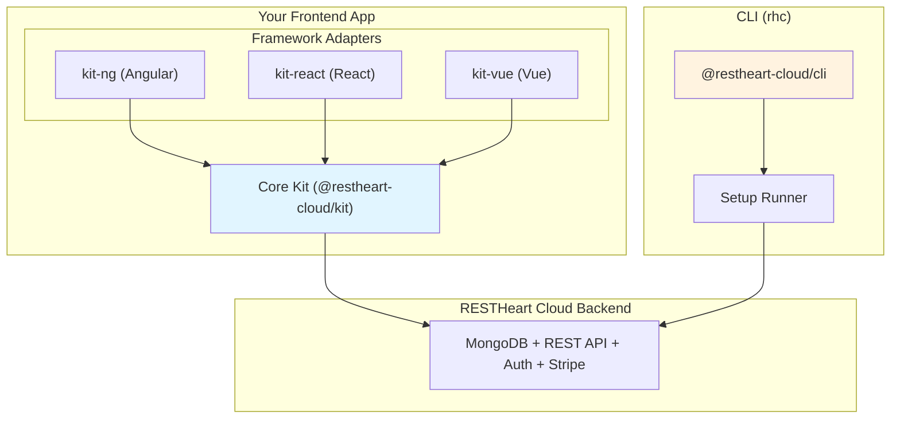

# RESTHeart Cloud Kit

A TypeScript SDK for adding authentication to frontend applications that use [RESTHeart Cloud](https://cloud.restheart.com) as their backend.

## What is RESTHeart Cloud Kit?

RESTHeart Cloud Kit provides the same speed on the frontend that RESTHeart Cloud gives you on the backend. It's a monorepo containing:

- **`@restheart-cloud/kit`** — Framework-agnostic core with zero dependencies. Handles all authentication logic: signup, login, email verification, password reset, team management, and multi-team switching. Also provides payments (subscriptions, Checkout, Billing Portal, seat licences), e-commerce (product catalog, orders, guest checkout), a client-side cart, and price formatting.
- **`@restheart-cloud/cli`** — The `rhc` command-line tool. Configures a RESTHeart Cloud service from a plan committed to git — collections, indexes, permissions and features, applied idempotently from a terminal or a CI pipeline.
- **`@restheart-cloud/kit-ng`** — Angular adapter with signals, route guards, and HTTP interceptor. Wraps the core kit.
- **`@restheart-cloud/kit-react`** — React adapter with context, hooks, and route guards. Includes a `/next` subpath for Next.js SSR support (middleware, route handlers, server actions).
- **`@restheart-cloud/kit-vue`** — Vue adapter with composables and navigation guards. Includes a `/nuxt` subpath for Nuxt SSR support.

## Architecture Overview



The architecture follows a layered pattern:
- **Core** (`kit`): All network calls, token operations, business rules
- **Adapters** (`kit-ng`, `kit-react`, `kit-vue`): Reactive wrappers, framework-specific integration
- **SSR subpaths** (`kit-react/next`, `kit-vue/nuxt`): Server-side token management via pluggable token source/sink
- **CLI** (`cli`): Declarative service configuration, independent of the frontend kit
- **Principle**: An adapter that reimplements an API call or token computation is a bug

## Quick Navigation

### Architecture & Design
- **[Architecture Overview](architecture/overview.md)** — Monorepo structure, package layering, design principles
- **[Token Delivery](architecture/token-delivery.md)** — Bearer vs cookie modes, SSR considerations

### Concepts
- **[Payments & E-commerce](concepts/payments.md)** — Subscriptions, Stripe Checkout/Portal, seat licences, product catalog, orders, guest checkout, cart, and price formatting

### Packages
- **[Core Kit](packages/kit.md)** — API reference, configuration, authentication flows
- **[CLI](packages/cli.md)** — `rhc` command, setup runner, admin/service clients, session management, env refs
- **[Angular Adapter](packages/kit-ng.md)** — RhAuthService, signals, guards, interceptor
- **[React Adapter](packages/kit-react.md)** — Hooks, context, guards, Next.js `/next` subpath
- **[Vue Adapter](packages/kit-vue.md)** — Composables, navigation guards, Nuxt `/nuxt` subpath

### Development
- **[Testing Guide](testing/guide.md)** — Core integration tests and adapter unit tests
- **[Release Process](deployment/release.md)** — Tag-driven releases, CI/CD pipeline
- **[Contributing](contributing/development.md)** — Local setup, workspace configuration, debugging

### External Resources
- **[RESTHeart Cloud Documentation](https://cloud.restheart.com)**
- **[Adapter Contract & Roadmap](https://github.com/SoftInstigate/restheart-cloud-kit/blob/main/docs/ADAPTERS.md)** — Framework adapter specifications
- **[Starter App](https://github.com/SoftInstigate/restheart-cloud-starter-ng)** — Angular starter template

## Task Routing

Use this table to find the right starting point for common change types:

| Change area | Wiki page | Source entry points | Important symbols | Focused tests | Validation |
|------------|-----------|--------------------|--------------------|--------------|------------|
| Auth flow (register, login, verify, logout) | [Core Kit](packages/kit.md#authentication-flows) | `packages/kit/src/auth.ts` | `register`, `login`, `verify`, `checkSession`, `applyBearerDelivery` | `packages/kit/src/__tests__/integration/auth.test.ts` | `npm test -w packages/kit` |
| Token management & refresh | [Core Kit](packages/kit.md#token-management) | `packages/kit/src/client.ts`, `packages/kit/src/auth.ts` | `setToken`, `getToken`, `clearToken`, `scheduleRefresh`, `cancelRefresh` | `packages/kit/src/__tests__/integration/auth.test.ts` | `npm test -w packages/kit` |
| Team operations | [Core Kit](packages/kit.md#team-operations) | `packages/kit/src/team.ts` | `getTeams`, `switchTeam`, `createTeam`, `listTeamMembers` | `packages/kit/src/__tests__/integration/team.test.ts`, `team-management.test.ts` | `npm test -w packages/kit` |
| Invitations | [Core Kit](packages/kit.md#invitation-flows) | `packages/kit/src/invite.ts` | `invite`, `activate`, `acceptInvite`, `listInvitations` | `packages/kit/src/__tests__/integration/invite.test.ts` | `npm test -w packages/kit` |
| Password reset | [Core Kit](packages/kit.md#password-management) | `packages/kit/src/password.ts` | `forgotPassword`, `resetPassword` | `packages/kit/src/__tests__/integration/password.test.ts` | `npm test -w packages/kit` |
| Profile updates | [Core Kit](packages/kit.md#profile-management) | `packages/kit/src/profile.ts` | `updateProfile`, `updateUser`, `changePassword` | `packages/kit/src/__tests__/integration/profile.test.ts` | `npm test -w packages/kit` |
<!-- openwiki: broken internal link [packages/kit.md#consents-gating] heading anchor "consents-gating" does not exist in "packages/kit.md". Fix the href or restore the target, then delete this comment. -->
| Consents gating | [Core Kit — Consents](packages/kit.md#consents-gating) | `packages/kit/src/consents.ts` | `acceptConsents` | `packages/kit/src/__tests__/integration/consents.test.ts` | `npm test -w packages/kit` |
| Payments (subscriptions, Checkout, Portal, licences) | [Payments & E-commerce](concepts/payments.md#subscriptions) | `packages/kit/src/payments.ts` | `getPlans`, `getSubscription`, `createCheckoutSession`, `openBillingPortal`, `getLicenses`, `grantLicense`, `revokeLicense`, `waitForSubscription` | `packages/kit/src/__tests__/unit/payments.test.ts` | `npm test -w packages/kit` |
<!-- openwiki: broken internal link [concepts/payments.md#e-commerce] heading anchor "e-commerce" does not exist in "concepts/payments.md". Fix the href or restore the target, then delete this comment. -->
| E-commerce (catalog, orders, guest checkout) | [Payments & E-commerce](concepts/payments.md#e-commerce) | `packages/kit/src/orders.ts` | `getCatalog`, `createOrder`, `getOrder`, `waitForOrder`, `readOrderRef`, `clearOrderRef` | `packages/kit/src/__tests__/unit/orders.test.ts` | `npm test -w packages/kit` |
<!-- openwiki: broken internal link [concepts/payments.md#cart] heading anchor "cart" does not exist in "concepts/payments.md". Fix the href or restore the target, then delete this comment. -->
| Cart (client-side, localStorage) | [Payments & E-commerce](concepts/payments.md#cart) | `packages/kit/src/cart.ts` | `addToCart`, `setCartQuantity`, `removeFromCart`, `cartTotals`, `toOrderItems`, `loadCart`, `saveCart`, `clearStoredCart` | `packages/kit/src/__tests__/unit/cart.test.ts` | `npm test -w packages/kit` |
<!-- openwiki: broken internal link [concepts/payments.md#price-formatting] heading anchor "price-formatting" does not exist in "concepts/payments.md". Fix the href or restore the target, then delete this comment. -->
| Price formatting | [Payments & E-commerce](concepts/payments.md#price-formatting) | `packages/kit/src/money.ts` | `formatPrice` | `packages/kit/src/__tests__/unit/money.test.ts` | `npm test -w packages/kit` |
| CLI setup runner (rhc setup, defineSetup, step, fromEnv) | [CLI](packages/cli.md#setup-runner) | `packages/cli/src/setup.ts`, `packages/cli/src/cli.ts`, `packages/cli/src/env.ts` | `defineSetup`, `step`, `runSetup`, `fromEnv`, `resolveEnvRefs` | `packages/cli/src/__tests__/unit/setup.test.ts`, `env.test.ts` | `npm test -w packages/cli` |
| CLI session & credentials (login, logout, PAT) | [CLI](packages/cli.md#session-management) | `packages/cli/src/session.ts`, `packages/cli/src/cli.ts` | `resolveToken`, `writeSession`, `clearSession`, `TOKEN_VAR` | `packages/cli/src/__tests__/unit/session.test.ts` | `npm test -w packages/cli` |
| CLI admin & service clients | [CLI](packages/cli.md#clients) | `packages/cli/src/admin.ts`, `packages/cli/src/service.ts` | `createAdminClient`, `createServiceClient` | `packages/cli/src/__tests__/unit/admin.test.ts`, `service.test.ts` | `npm test -w packages/cli` |
| Angular adapter (signals, guards, interceptor) | [Angular Adapter](packages/kit-ng.md) | `packages/kit-ng/src/auth.service.ts`, `auth.guard.ts`, `auth.interceptor.ts` | `RhAuthService`, `authGuard`, `provideRhAuth` | `packages/kit-ng/src/*.spec.ts` | `npm test -w packages/kit-ng` |
| React adapter (hooks, context, guards) | [React Adapter](packages/kit-react.md) | `packages/kit-react/src/context.tsx`, `guards.tsx` | `useAuth`, `RhAuthProvider`, `AuthGuard` | `packages/kit-react/src/__tests__/` | `npm test -w packages/kit-react` |
| Next.js SSR (middleware, route handlers, server actions) | [React Adapter — /next](packages/kit-react.md#nextjs-subpath-next) | `packages/kit-react/src/next/` | `rhAuthMiddleware`, `createSessionRoute`, `rhLogin`, `SessionSync` | `packages/kit-react/src/next/__tests__/` | `npm test -w packages/kit-react` |
| Vue adapter (composables, guards) | [Vue Adapter](packages/kit-vue.md) | `packages/kit-vue/src/store.ts`, `create.ts`, `guards.ts` | `createRhAuth`, `useAuth`, `buildGuards` | `packages/kit-vue/src/__tests__/` | `npm test -w packages/kit-vue` |
| Nuxt SSR (middleware, handler, bridge) | [Vue Adapter — /nuxt](packages/kit-vue.md#nuxt-subpath-nuxt) | `packages/kit-vue/src/nuxt/` | `rhAuthServerMiddleware`, `createSessionHandler`, `bridgeFragmentToCookie` | `packages/kit-vue/src/nuxt/__tests__/` | `npm test -w packages/kit-vue` |
| Token delivery (bearer vs cookie) | [Token Delivery](architecture/token-delivery.md) | `packages/kit/src/auth.ts`, `packages/kit/src/client.ts` | `applyBearerDelivery`, `persistToken`, `LoginMode` | `packages/kit/src/__tests__/integration/auth.test.ts` | `npm test -w packages/kit` |
| Package publishing / release | [Release Process](deployment/release.md) | `.github/workflows/release.yml` | tag-driven versioning | Integration tests (gated) | `git tag X.Y.Z && git push origin X.Y.Z` |
| Types & interfaces | [Core Kit](packages/kit.md#type-definitions) | `packages/kit/src/types.ts` | `UserInfo<E>`, `TeamMembership`, `AuthConfig`, `ApiError`, `LoginMode` | All integration tests | `npm run build` |
| Authenticated fetch (`apiFetch` / `auth.api()`) | [Core Kit](packages/kit.md#authenticated-fetch-apifetch) | `packages/kit/src/client.ts` | `apiFetch` | `packages/kit/src/__tests__/unit/client.test.ts` | `npm test -w packages/kit` |

## Getting Started

### 1. Prerequisites

- Node.js 22.22.3+ (required by Angular 22 CLI for `kit-ng` tests)
- npm 9+ (workspaces support)
- A RESTHeart Cloud service ([sign up](https://cloud.restheart.com))

### 2. Installation

```bash
# Clone the repository
git clone https://github.com/SoftInstigate/restheart-cloud-kit.git
cd restheart-cloud-kit

# Install dependencies
npm install
```

### 3. Build

```bash
# Build all packages (kit first, then adapters)
npm run build
```

### 4. Run Tests

Integration tests require a RESTHeart Cloud instance:

```bash
# Create packages/kit/.env (not committed)
cat > packages/kit/.env << EOF
RH_TEST_API_URL=https://<your-instance>.restheart.com
RH_TEST_ADMIN_PASSWORD=<root-password>
EOF

# Run integration tests
npm test -w packages/kit
```

Adapter unit tests need no backend:

```bash
npm run build   # adapters resolve @restheart-cloud/kit from its built dist
npm test -w packages/kit-react -w packages/kit-vue -w packages/kit-ng
```

CLI unit tests need no backend either:

```bash
npm test -w packages/cli
```

### 5. Local Development with Starter App

For developing against a local Angular app:

```bash
# Link packages locally
npm link -w packages/kit
cd packages/kit-ng/dist && npm link

# In your Angular starter app
npm link @restheart-cloud/kit @restheart-cloud/kit-ng
```

### 6. Using the CLI

```bash
# Install globally (or use npx)
npm i -g @restheart-cloud/cli

# Log in with a personal access token (issued at cloud.restheart.com)
rhc login

# Run a setup file against a service
rhc setup --srv ea820b

# Dry-run: check what would change, apply nothing
rhc setup --srv ea820b --dry-run
```

See **[CLI](packages/cli.md)** for the full command reference, setup file format, and CI pipeline integration.

## Key Concepts

### Authentication Modes

The kit supports two authentication modes:

1. **Bearer Token** (default) — Token stored in `localStorage`, sent as `Authorization: Bearer <token>`. Works cross-origin.
2. **Cookie** — JWT managed by backend as HttpOnly cookie. Only works same-origin (app and API on same domain).

**Important**: RESTHeart Cloud services live on `*.restheart.com`, so cookie mode is not available for normal deployments. Use bearer mode unless you have a same-origin setup.

### Token Lifecycle

- Tokens expire after 15 minutes
- Proactive refresh at 80% of TTL (~12 minutes)
- Sessions survive page reloads but not browser sessions if token expires
- Automatic cleanup on 401 responses
- **Unverified accounts**: Users with the `$unauthenticated` role (registered but not email-verified) are rejected by `login()` (throws 403) and `checkSession()` (returns null). See [Core Kit — Login](packages/kit.md#login).

### Team Multi-tenancy

Users can belong to multiple teams:
- Switch active team with `switchTeam()`
- Team context included in JWT claims
- Team-scoped operations (members, invitations)

### Consents Gating

Applications can gate access behind a user's acceptance of terms of service, privacy policy, or any other consent. The pattern:

1. A guard rule blocks requests from users who have not accepted the current consent versions.
2. An ACL permission on `PATCH /users/{userId}` — scoped with `bson-request-whitelist` — exempts the one call that records the acceptance.
3. `acceptConsents()` calls `updateUser()` then `renewToken()` so the guard sees the updated claims.

<!-- openwiki: broken internal link [packages/kit.md#consents-gating] heading anchor "consents-gating" does not exist in "packages/kit.md". Fix the href or restore the target, then delete this comment. -->
**Key invariant**: the server decides which versions are stamped and when — the client body carries only the whitelisted key. See [Core Kit — Consents Gating](packages/kit.md#consents-gating) for the full API.

### Payments & Subscriptions

The kit integrates with Stripe for subscription billing and one-time product purchases. The payments subsystem is opt-in: set `payments: true` in `AuthConfig` to load subscription state on session events.

**Subscriptions** — Plans are fetched from `GET /stripe/plans` (public, no session required). The team's subscription comes from `GET /stripe/subscription`. Checkout creates a new subscription via Stripe Checkout (`createCheckoutSession`); existing subscribers manage theirs through the Stripe Billing Portal (`openBillingPortal`). Seat licences are managed separately with `grantLicense`/`revokeLicense`.

**Key invariant**: subscription state is resolved server-side from the database on every request (via `SubscriptionVarResolver`), not from the JWT. An upgrade is effective immediately with no re-login and no `renewToken` call.

**Webhook race**: the redirect back from Stripe Checkout races the webhook. A success page that calls `getSubscription` immediately may read the old plan. Use `waitForSubscription` (polls with a predicate) instead. See [Payments & E-commerce](concepts/payments.md) for the full API.

### E-commerce (Catalog, Orders, Cart)

The kit provides a complete client-side e-commerce flow:

- **Catalog** — `getCatalog` reads a MongoDB collection (configurable name) with pagination, filtering, and sorting. Access is controlled by the deployment's own ACL.
- **Orders** — `createOrder` creates an order and starts Stripe Checkout. Prices are resolved server-side from the catalog; nothing the client sends is trusted for pricing. Guest checkout is supported via an `email` parameter and a `secret` returned with the order.
- **Cart** — Pure functions (`addToCart`, `setCartQuantity`, `removeFromCart`, `cartTotals`) that operate on arrays. Nothing here talks to a server. `toOrderItems` converts cart lines to the shape `createOrder` expects. `loadCart`/`saveCart` persist to `localStorage`.
- **Price formatting** — `formatPrice` converts minor-unit amounts (cents) to locale-aware display strings using `Intl.NumberFormat`.

See [Payments & E-commerce](concepts/payments.md) for the full API.

### CLI & Declarative Service Configuration

The `@restheart-cloud/cli` package provides the `rhc` command for configuring RESTHeart Cloud services from a plan committed to git. A setup file exports a `Setup` — a named list of `Step` objects, each with a `check` (is this already so?) and an `apply` (make it so). The runner executes steps sequentially; a failure halts the rest. A dry run runs every check and applies nothing.

**Key symbols**: `defineSetup` declares a setup, `step` declares a step, `runSetup` executes it, `fromEnv` references secrets without holding them (resolved at apply time, never printed or logged).

**Key invariant**: after an apply, the runner re-checks with exponential backoff up to 15 seconds to handle admin-node/service-node cache lag. A step that silently did nothing is reported failed rather than green.

**Exit codes**: 0 = every step satisfied or applied, 1 = a step failed, 2 = a dry run found work outstanding (configuration drift, not an error).

**Credentials**: personal access tokens (PATs) starting with `rhc_live_`, carrying the `cli` role. Stored 0600 under `~/.config/restheart` by `rhc login`, or set via `RH_CLOUD_TOKEN` in pipelines. The env var always wins over a stored session. See [CLI](packages/cli.md) for the full reference.

### Framework Adapter Pattern

The architecture follows a layered pattern:
- **Core** (`kit`): All network calls, token operations, business rules
- **Adapters** (`kit-ng`, `kit-react`, `kit-vue`): Reactive wrappers, framework-specific integration
- **SSR subpaths** (`kit-react/next`, `kit-vue/nuxt`): Server-side token management via pluggable token source/sink
- **CLI** (`cli`): Declarative service configuration, independent of the frontend kit
- **Principle**: An adapter that reimplements an API call or token computation is a bug

See **[docs/ADAPTERS.md](https://github.com/SoftInstigate/restheart-cloud-kit/blob/main/docs/ADAPTERS.md)** for the full adapter contract and **[docs/ADAPTER_CONTRACT.md](https://github.com/SoftInstigate/restheart-cloud-kit/blob/main/docs/ADAPTER_CONTRACT.md)** for the shared test checklist.

## Common Workflows

### User Registration Flow

```typescript
import { register, verify, buildVerifyUrl } from '@restheart-cloud/kit';

// 1. Register
await register(config, { email, password, teamName: 'My Team' });

// 2. Build verification URL (sent via email)
const verifyUrl = buildVerifyUrl(config, email, token, 'fragment');

// 3. User clicks link, app reads token from URL hash
// 4. Store token
setToken(token);
```

### Subscription Checkout Flow

```typescript
import { getPlans, createCheckoutSession, waitForSubscription } from '@restheart-cloud/kit';

// 1. Show plans (public — no session required)
const { plans } = await getPlans(config);

// 2. Start Checkout (requires canManageBilling)
const { url } = await createCheckoutSession(config, 'gold', 'month');
window.location.href = url;

// 3. On the success page, wait for the webhook
const sub = await waitForSubscription(config, s => s.plan === 'gold' && s.active);
```

### E-commerce Checkout Flow

```typescript
import { getCatalog, addToCart, toOrderItems, createOrder, waitForOrder, readOrderRef, clearOrderRef } from '@restheart-cloud/kit';

// 1. Browse catalog
const items = await getCatalog(config, { filter: { category: 'desk' } });

// 2. Build cart (pure, client-side)
let cart = addToCart([], { productId: 'tee-classic', name: 'Classic T-shirt', unitAmount: 2500, currency: 'eur' });

// 3. Checkout — creates order and redirects to Stripe
const { checkout_url } = await createOrder(config, toOrderItems(cart), 'buyer@example.com');
window.location.href = checkout_url;

// 4. On the success page, read the order reference from the URL
const ref = readOrderRef();
if (ref) {
  clearOrderRef();
  const order = await waitForOrder(config, ref.id, ref.secret);
}
```

### CLI Setup File

```typescript
// rhc.setup.ts
import { defineSetup, step, fromEnv } from '@restheart-cloud/cli';

export default defineSetup('My Shop', [
  step('stripe feature installed', {
    check: ({ admin, srvId }) => admin.isFeatureInstalled(srvId, 'stripe'),
    apply: ({ admin, srvId }) => admin.installFeature(srvId, 'stripe'),
  }),
  step('stripe feature configured', {
    check: ({ admin, srvId }) => admin.getFeatureConfig(srvId, 'stripe').then(c => c?.['secret-key'] != null),
    apply: ({ admin, srvId }) => admin.updateFeatureConfig(srvId, 'stripe', {
      'secret-key': fromEnv('STRIPE_SECRET_KEY'),
      'success-url': 'https://shop.example.com/order#order={ORDER_ID}&secret={ORDER_SECRET}',
    }),
  }),
]);
```

### Angular Integration

```typescript
import { provideRhAuth } from '@restheart-cloud/kit-ng';

// In app.config.ts
export const appConfig: ApplicationConfig = {
  providers: [
    provideRhAuth({ apiBaseUrl: environment.apiUrl }),
  ],
};

// In component
@Component({
  template: `
    @if (auth.isAuthenticated()) {
      <span>{{ auth.user()?.profile?.name }}</span>
    }
  `
})
export class AppComponent {
  auth = inject(RhAuthService);
}
```

### React Integration

```tsx
import { RhAuthProvider, useAuth } from '@restheart-cloud/kit-react';

// Near app root
createRoot(document.getElementById('root')!).render(
  <RhAuthProvider config={{ apiBaseUrl: import.meta.env.VITE_API_URL }}>
    <App />
  </RhAuthProvider>
);

// In component
function Header() {
  const auth = useAuth();
  if (!auth.isAuthenticated) return null;
  return <span>{auth.user?.profile?.name}</span>;
}
```

### Vue Integration

```ts
import { createRhAuth, useAuth } from '@restheart-cloud/kit-vue';

// main.ts
const rhAuth = createRhAuth({ apiBaseUrl: import.meta.env.VITE_API_URL });
app.use(rhAuth);

// Component
const auth = useAuth();
// auth.isAuthenticated.value, auth.user.value, auth.teams.value
```

## Version Information

- **Current version**: 0.0.0 (development, tag-driven releases)
- **Required RESTHeart**: 9.6.0+ (for `delivery=body` support)
- **Node**: 22.22.3+ (required by Angular 22 CLI for `kit-ng` tests)
- **Angular**: 21+ (peer dependency for kit-ng)
- **TypeScript**: 5+ (kit, kit-react, kit-vue, cli), 6+ (kit-ng, Angular 22 CLI requirement)
- **Vitest**: 4 (all adapter unit tests, CLI unit tests)

## Support

- **Issues**: [GitHub Issues](https://github.com/SoftInstigate/restheart-cloud-kit/issues)
- **Documentation**: [RESTHeart Cloud Docs](https://cloud.restheart.com)
- **Starter App**: [restheart-cloud-starter-ng](https://github.com/SoftInstigate/restheart-cloud-starter-ng)
